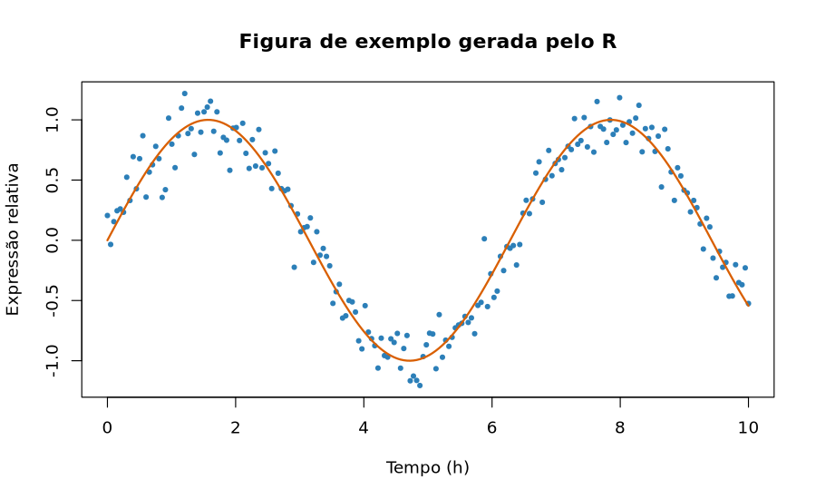

```{r}
#| label: setup-oculto
#| include: false

# Gera uma imagem de exemplo usada na seção de Markdown,
# para que o material seja 100% autocontido (sem arquivos externos).
dir.create("imagens", showWarnings = FALSE)
png("imagens/exemplo-expressao.png", width = 900, height = 550, res = 110)
set.seed(42)
x <- seq(0, 10, length.out = 200)
plot(x, sin(x) + rnorm(200, sd = 0.15),
     type = "p", pch = 19, cex = 0.6, col = "#2C7FB8",
     xlab = "Tempo (h)", ylab = "Expressão relativa",
     main = "Figura de exemplo gerada pelo R")
lines(x, sin(x), lwd = 2, col = "#D95F02")
dev.off()
```

::: {.callout-note appearance="simple"}
## Como usar este documento

Este é o **material de apoio completo** do minicurso: conteúdo, exemplos e
soluções comentadas de todos os exercícios.

- As soluções ficam escondidas em blocos recolhíveis — clique em
  *"Ver solução"* para abrir. Tente resolver antes de espiar!
- Todo o código aqui é reproduzível: você pode copiar, colar e renderizar.
- Os slides usados em aula estão em `slides-minicurso-quarto.qmd`.
:::

# Antes de começar {#sec-setup}

## Preparando o ambiente

```bash
# 1. Clone o repositório e entre nele
git clone https://github.com/juliaapolonio/intro-to-quarto.git
cd intro-to-quarto

# 2. Crie o ambiente conda a partir da receita
conda env create -f environment.yml

# 3. Ative o ambiente
conda activate quarto-env

# 4. Abra o Positron
positron .
```

Para conferir se está tudo certo:

```bash
quarto check
```

O comando acima verifica a instalação do Quarto, do Pandoc, do TinyTeX (para
PDF) e dos motores de execução disponíveis (R via `knitr`, Python via
`jupyter`). Se algum item aparecer com `[✓]`, está funcionando.

::: {.callout-tip}
## Por que Positron?

O [Positron](https://positron.posit.co/) é uma IDE da Posit (mesma empresa do
RStudio e do Quarto) construída sobre o VS Code. Ela tem suporte nativo a
Quarto, painel de variáveis, console de R **e** de Python na mesma janela — o
que é conveniente para quem trabalha com bioinformática e transita entre as
duas linguagens. Tudo neste curso funciona igualmente bem no RStudio, no
VS Code (com a extensão Quarto) ou em qualquer editor de texto + terminal.
:::

## Agenda {#sec-agenda}

| Bloco | Conteúdo | Tempo |
|:------|:---------|------:|
| 1 | Introdução: por que Quarto, extensões, documentação | 20 min |
| 2 | O Quarto: features, renderização, R Markdown vs Quarto | 25 min |
| 3 | Notação Markdown (Exercícios 1 e 2) | 70 min |
| — | ☕ Intervalo | 15 min |
| 4 | Header / YAML (Exercício 3) | 35 min |
| 5 | Personalização (Exercício 4) | 50 min |
| 6 | Code chunks (Exercício 5) | 70 min |
| 7 | Encerramento e próximos passos | 15 min |
| | **Total** | **5 h** |

: Agenda do minicurso {#tbl-agenda .striped .hover}

# Introdução {#sec-introducao}

## Por que usar Quarto?

Imagine o fluxo de trabalho clássico de uma análise de bioinformática:

1. Rodar o pipeline no cluster;
2. Abrir o R, gerar 12 figuras e 5 tabelas;
3. Salvar tudo como `.png` e `.csv` numa pasta `resultados/`;
4. Abrir o Word, colar as figuras, escrever o texto ao redor;
5. O orientador pede para trocar o filtro de *p*-valor de 0,05 para 0,01;
6. **Voltar ao passo 1 e refazer tudo à mão.**

O Quarto elimina os passos 3 a 6. O texto, o código e os resultados moram no
mesmo arquivo; quando o dado muda, o documento inteiro se atualiza com um
comando. Isso é o que Knuth [@knuth1984] chamou de *literate programming* e o
que hoje chamamos de **pesquisa reproduzível** [@peng2011; @sandve2013].

Na prática, os ganhos são:

- **Reprodutibilidade.** O número que está no texto foi calculado, não digitado.
- **Rastreabilidade.** O `.qmd` é texto puro → versiona bem no Git, dá para
  fazer *diff* e *code review* de um relatório.
- **Um fonte, vários destinos.** O mesmo arquivo vira HTML, PDF, Word, slides,
  site, livro ou dashboard.
- **Poliglota.** R, Python, Julia e Observable JS no mesmo documento — útil
  quando o alinhamento é em Python e a estatística é em R.
- **Estética decente por padrão.** Você não precisa saber CSS para produzir
  algo apresentável (mas dá para ir longe se souber).

::: {.callout-important}
## A regra de ouro

Se você teve que **copiar e colar um resultado** para dentro do texto, esse
resultado vai ficar desatualizado. É só uma questão de tempo.
:::

## Onde o Quarto se encaixa

```{mermaid}
%%| label: fig-fluxo
%%| fig-cap: "Fluxo de um documento Quarto, do código-fonte aos formatos de saída."

flowchart LR
    A["documento.qmd<br/>(texto + código)"] --> B["knitr / jupyter<br/>executa o código"]
    B --> C["documento.md<br/>(markdown puro)"]
    C --> D["Pandoc<br/>converte"]
    D --> E["HTML"]
    D --> F["PDF (LaTeX)"]
    D --> G["Word (docx)"]
    D --> H["revealjs (slides)"]
```

## Extensões

O ecossistema de extensões amplia o Quarto sem que você precise escrever
filtros Lua do zero. Instalação e uso:

```bash
# Instalar uma extensão no projeto atual
quarto add quarto-ext/fontawesome

# Listar o que está instalado
quarto list extensions

# Atualizar / remover
quarto update quarto-ext/fontawesome
quarto remove quarto-ext/fontawesome
```

Extensões úteis para quem trabalha com ciência:

| Extensão | Para que serve |
|:---------|:---------------|
| `quarto-ext/fontawesome` | Ícones no texto e nos slides |
| `quarto-journals/*` | Templates de periódicos (PLOS, Elsevier, ACM…) |
| `mcanouil/quarto-iconify` | Acesso a ~200 mil ícones |
| `shafayetShafee/downloadthis` | Botão de download de arquivos no HTML |
| `quarto-ext/lightbox` | Clique na figura para ampliar |
| `EmilHvitfeldt/quarto-roughnotation` | Anotações animadas em slides |
| `quarto-ext/pointer` | Laser pointer em apresentações |

Catálogo completo: <https://quarto.org/docs/extensions/>

::: {.callout-warning}
Extensões são instaladas **por projeto**, dentro da pasta `_extensions/`.
Commite essa pasta no Git — senão quem clonar seu repositório não conseguirá
renderizar.
:::

## Documentação

- Documentação oficial: <https://quarto.org/docs/guide/> — excelente e com
  exemplos copiáveis.
- Referência de todas as opções de YAML: <https://quarto.org/docs/reference/>
- Galeria de exemplos: <https://quarto.org/docs/gallery/>
- *Awesome Quarto* (lista comunitária): <https://github.com/mcanouil/awesome-quarto>
- Fórum de dúvidas: <https://github.com/quarto-dev/quarto-cli/discussions>

::: {.callout-tip}
## Dica de estudo

Quase toda página da documentação do Quarto tem a opção de ver o código-fonte
do exemplo. Quando algo parecer mágico, procure o `.qmd` original.
:::

# O Quarto {#sec-quarto}

## Features principais

Um arquivo `.qmd` tem três tipos de conteúdo:

1. **Header YAML** — os metadados e as opções, entre `---` e `---`, no topo.
2. **Texto em Markdown** — a narrativa.
3. **Blocos de código (*chunks*)** — o que é executado.

Esqueleto mínimo:

````markdown
---
title: "Meu relatório"
format: html
---

## Introdução

Texto normal em **markdown**.
````

E um bloco de código executável tem esta forma:

```{{r}}
#| label: exemplo
#| echo: true
1 + 1
```

Que ao renderizar produz:

```{r}
#| label: exemplo
#| echo: true
1 + 1
```

::: {.callout-note}
## Anatomia de um chunk

- `` ```{r} `` abre o bloco e diz qual linguagem executar (`r`, `python`,
  `julia`, `bash`, `mermaid`, `dot`…).
- As linhas iniciadas por `#|` (*hash-pipe*) são as **opções do chunk**, escritas
  em YAML.
- `` ``` `` fecha o bloco.
:::

## Renderização

```bash
# Renderizar um arquivo
quarto render documento.qmd

# Renderizar num formato específico
quarto render documento.qmd --to pdf

# Servidor com recarregamento automático (ótimo para desenvolver)
quarto preview documento.qmd

# Renderizar um projeto inteiro
quarto render
```

No Positron/RStudio existe o botão **Render** (atalho `Ctrl/Cmd + Shift + K`),
que faz exatamente a mesma coisa.

::: {.callout-tip}
## `preview` é seu melhor amigo

`quarto preview` abre o documento no navegador e re-renderiza sozinho a cada vez
que você salva. Deixe rodando numa aba do terminal durante todo o
desenvolvimento.
:::

## Formatos de saída

| Formato | Chave no YAML | Observação |
|:--|:--|:--|
| Página web | `html` | Padrão; interativo, leve |
| Artigo | `pdf` | Via LaTeX; requer TinyTeX |
| Word | `docx` | Para colaborar com quem não usa R |
| Slides | `revealjs`, `beamer`, `pptx` | `revealjs` é HTML e é o mais poderoso |
| Site / livro | projeto `website`, `book` | Vários `.qmd` num só produto |
| Dashboard | `dashboard` | Painéis com *value boxes* e abas |
| Markdown | `gfm`, `commonmark` | Ótimo para README de repositório |

: Principais formatos de saída {#tbl-formatos .striped}

## R Markdown vs Quarto

O Quarto é o **sucessor** do R Markdown, escrito do zero em TypeScript e
independente do R. Não é um pacote de R: é um programa de linha de comando.

| | R Markdown (`.Rmd`) | Quarto (`.qmd`) |
|:--|:--|:--|
| Motor | Pacote `rmarkdown` (exige R) | Executável independente |
| Linguagens | R (Python via `reticulate`) | R, Python, Julia, OJS nativamente |
| Opções de chunk | Na chave: `{r fig.width=6}` | No corpo: `#| fig-width: 6` |
| Nomes das opções | `fig.width`, `out.width` | `fig-width`, `out-width` |
| Cross-references | Precisa do `bookdown` | Nativo (`@fig-`, `@tbl-`, `@eq-`) |
| Callouts, tabsets, layout | Precisa de pacotes/CSS | Nativos |
| Slides | `xaringan`, `ioslides` | `revealjs` nativo |
| Consistência entre formatos | Cada formato, um pacote | Uma sintaxe só |

: Comparação R Markdown × Quarto {#tbl-rmd-quarto .striped}

::: {.callout-note}
## Preciso migrar tudo?

Não. O Quarto renderiza arquivos `.Rmd` sem alterações na maioria dos casos —
basta rodar `quarto render arquivo.Rmd`. A migração pode ser gradual: comece
usando `.qmd` nos projetos novos.
:::

Duas diferenças que pegam todo mundo desprevenido:

1. **Ponto vira hífen.** `fig.cap` → `fig-cap`, `out.width` → `out-width`.
2. **Opções saem do cabeçalho do chunk.** Em vez de
   `` ```{r meu-chunk, echo=FALSE} ``, escreva o rótulo na chave e o resto com
   `#|`:

```{{r}}
#| label: meu-chunk
#| echo: false
```

# Notação Markdown {#sec-markdown}

Markdown é uma linguagem de marcação criada para ser legível mesmo sem
renderizar. O Quarto usa o **Pandoc Markdown**, que é um superconjunto do
Markdown clássico.

## Formatação de texto

| Você escreve | Você obtém |
|:--|:--|
| `*itálico*` ou `_itálico_` | *itálico* |
| `**negrito**` | **negrito** |
| `***negrito e itálico***` | ***negrito e itálico*** |
| `~~riscado~~` | ~~riscado~~ |
| `` `código` `` | `código` |
| `H~2~O` | H~2~O (subscrito) |
| `10^-9^` | 10^-9^ (sobrescrito) |
| `[versalete]{.smallcaps}` | [versalete]{.smallcaps} |
| `> citação` | bloco de citação |

: Formatação básica de texto {#tbl-formatacao .striped}

Um parágrafo novo exige **uma linha em branco**. Se você quiser apenas quebrar
a linha sem começar um parágrafo, termine a linha com dois espaços ou uma barra
invertida `\`.

> Blocos de citação começam com `>`.
> Servem para destacar trechos citados de outra fonte.

## Títulos

```markdown
# Título de nível 1
## Título de nível 2
### Título de nível 3
```

::: {.callout-warning}
## Um `#` só por documento

Se você usa `title:` no YAML, o Quarto já cria o título principal. Comece suas
seções em `##` para não ter dois títulos de nível 1 competindo — isso também
melhora a acessibilidade e o sumário.
:::

Para dar um identificador manual a uma seção (e poder referenciá-la):

```markdown
## Métodos {#sec-metodos}
```

E então, no texto: `Como descrito na @sec-metodos...` — desde que
`number-sections: true` esteja no YAML.

## Links e imagens

```markdown
[texto do link](https://quarto.org)
<https://quarto.org>                      <!-- link automático -->
[link com tooltip](https://quarto.org "Site oficial")
[link para outra seção](#sec-markdown)


{width=60%}
{#fig-minha fig-align="left"}
```

A diferença entre link e imagem é o `!` na frente. Resultado:

{#fig-exemplo-md width=85%}

Repare que a @fig-exemplo-md recebeu um `id` começando com `fig-` — isso é o que
a torna referenciável.

::: {.callout-tip}
## Sempre use caminhos relativos

`imagens/figura.png` funciona na máquina de qualquer pessoa que clonar o
repositório. `/home/diego/Documentos/figura.png` não.
:::

## Listas

```markdown
- item
- outro item
  - subitem (indente com 2 ou 4 espaços)
- terceiro

1. primeiro
2. segundo
3. terceiro

- [ ] tarefa pendente
- [x] tarefa concluída

Termo
: Definição do termo
```

Renderizado:

- item
- outro item
  - subitem
- terceiro

1. primeiro
2. segundo
3. terceiro

FASTQ
: Formato de texto que armazena sequências e suas qualidades por base.

VCF
: *Variant Call Format*; formato padrão para variantes genéticas.

::: {.callout-warning}
## Listas precisam de linha em branco antes

Este é o bug de Markdown mais comum do mundo. Sem uma linha em branco separando
o parágrafo da lista, o Pandoc trata tudo como um parágrafo só.
:::

## Exercício 1 {#sec-ex1}

::: {.callout-note icon=false}
## 🧪 Exercício 1 — Seu primeiro documento (15 min)

Crie um arquivo `exercicio1.qmd` e produza um HTML com:

1. Um header YAML com **título**, **seu nome** e `format: html`.
2. Uma seção `## Sobre mim` com um parágrafo em texto corrido contendo pelo
   menos uma palavra em **negrito** e uma em *itálico*.
3. Uma seção `## Ferramentas que eu uso` com uma **lista não ordenada** de 3
   ferramentas, sendo que uma delas tem **dois subitens**.
4. Uma seção `## Passos de uma análise de RNA-seq` com uma **lista ordenada**
   de 4 etapas.
5. Um **link** para a documentação do Quarto e a **imagem** que geramos em
   `imagens/exemplo-expressao.png` com largura de 70%.
6. Uma fórmula química com subscrito (ex.: `CO~2~`) em algum lugar do texto.

Renderize com `quarto render exercicio1.qmd` e abra o HTML.
:::

::: {.callout-tip collapse="true"}
## ✅ Ver solução do Exercício 1

````markdown
---
title: "Exercício 1 — Primeiros passos"
author: "Fulana de Tal"
date: today
lang: pt-BR
format: html
---

## Sobre mim

Sou **bioinformata** e trabalho principalmente com dados de *RNA-seq* de
plantas do semiárido. Meu interesse é entender como a expressão gênica
responde ao estresse hídrico e à concentração de CO~2~.

## Ferramentas que eu uso

- R
  - tidyverse
  - DESeq2
- Python
- Nextflow

## Passos de uma análise de RNA-seq

1. Controle de qualidade das leituras (FastQC)
2. Trimagem de adaptadores (fastp)
3. Quantificação (Salmon)
4. Expressão diferencial (DESeq2)

## Referências

A documentação oficial está em [quarto.org](https://quarto.org/docs/guide/).

{width=70%}
````

**Pontos de atenção mais comuns:**

- Faltou a linha em branco antes da lista → tudo vira um parágrafo.
- Os subitens precisam de indentação consistente (2 ou 4 espaços, não misture).
- `date: today` só funciona no Quarto (no R Markdown daria erro).
- Se a imagem não aparecer, confira o caminho relativo a partir do `.qmd`.
:::

## Footnotes

```markdown
Este método é amplamente usado.[^1]

[^1]: Ainda que existam críticas relevantes na literatura recente.

Também dá para usar notas em linha.^[Assim, sem precisar declarar depois.]
```

Resultado: este método é amplamente usado.[^exemplo]

[^exemplo]: Ainda que existam críticas relevantes na literatura recente.

Também dá para usar notas em linha.^[Assim, sem precisar declarar depois.]

O rótulo (`[^1]`, `[^metodo]`) é apenas interno; a numeração final é automática
e segue a ordem de aparição no texto.

## Tabelas

### Tabelas de pipe

```markdown
| Gene    | log2FC | p-ajustado |
|:--------|-------:|-----------:|
| BRCA1   |   2,31 |     0,0001 |
| TP53    |  -1,87 |     0,0034 |
| EGFR    |   0,45 |     0,2100 |

: Genes diferencialmente expressos {#tbl-degs}
```

O alinhamento é definido pelos dois-pontos na linha de separação:
`:---` à esquerda, `---:` à direita, `:---:` centralizado.

| Gene    | log2FC | p-ajustado |
|:--------|-------:|-----------:|
| BRCA1   |   2,31 |     0,0001 |
| TP53    |  -1,87 |     0,0034 |
| EGFR    |   0,45 |     0,2100 |

: Genes diferencialmente expressos (exemplo ilustrativo) {#tbl-degs .striped .hover}

### Tabelas de grade

Quando você precisa de várias linhas dentro de uma célula ou de listas dentro
da tabela:

```markdown
+---------------+---------------------------+
| Etapa         | Ferramentas               |
+===============+===========================+
| QC            | - FastQC                  |
|               | - MultiQC                 |
+---------------+---------------------------+
| Alinhamento   | - STAR                    |
|               | - HISAT2                  |
+---------------+---------------------------+
```

+---------------+---------------------------+
| Etapa         | Ferramentas               |
+===============+===========================+
| QC            | - FastQC                  |
|               | - MultiQC                 |
+---------------+---------------------------+
| Alinhamento   | - STAR                    |
|               | - HISAT2                  |
+---------------+---------------------------+

: Exemplo de tabela de grade {#tbl-grade}

::: {.callout-tip}
## Não escreva tabelas grandes à mão

Para qualquer coisa acima de ~10 linhas, gere a tabela a partir dos dados com
`knitr::kable()` ou `gt` (veremos na @sec-chunks). Escrever a mão é
retrabalho garantido.

Para converter uma tabela existente em Markdown, o site
<https://www.tablesgenerator.com/markdown_tables> ajuda bastante.
:::

Classes úteis para tabelas em HTML: `.striped`, `.hover`, `.bordered`,
`.borderless`, `.sm`. Aplicam-se na mesma chave da legenda.

## Equações

Equações usam sintaxe LaTeX. Em linha, entre cifrões simples: `$E = mc^2$` →
$E = mc^2$.

Em bloco, entre cifrões duplos:

```markdown
$$
\text{CPM}_{ij} = \frac{c_{ij}}{\sum_{k} c_{kj}} \times 10^6
$$
```

$$
\text{CPM}_{ij} = \frac{c_{ij}}{\sum_{k} c_{kj}} \times 10^{6}
$$

Para poder referenciar, dê um `id` começando com `eq-`:

```markdown
$$
\log_2 \text{FC} = \log_2\!\left(\frac{\mu_{\text{tratado}}}{\mu_{\text{controle}}}\right)
$$ {#eq-log2fc}
```

$$
\log_2 \text{FC} = \log_2\!\left(\frac{\mu_{\text{tratado}}}{\mu_{\text{controle}}}\right)
$$ {#eq-log2fc}

E cite no texto com `@eq-log2fc`: o *fold change* da @eq-log2fc é a métrica mais
reportada em estudos de expressão diferencial.

Alguns comandos que você vai usar bastante:

| LaTeX | Resultado |
|:--|:--|
| `\alpha, \beta, \mu, \sigma` | $\alpha, \beta, \mu, \sigma$ |
| `x_i`, `x^2` | $x_i$, $x^2$ |
| `\frac{a}{b}` | $\frac{a}{b}$ |
| `\sum_{i=1}^{n}` | $\sum_{i=1}^{n}$ |
| `\sqrt{x}`, `\overline{x}` | $\sqrt{x}$, $\overline{x}$ |
| `\leq`, `\geq`, `\neq`, `\approx` | $\leq, \geq, \neq, \approx$ |
| `\hat{\beta}`, `\text{texto}` | $\hat{\beta}$, $\text{texto}$ |

: Comandos LaTeX frequentes {#tbl-latex .striped}

## Diagramas

O Quarto tem suporte nativo a **Mermaid** e **Graphviz**, sem instalação extra.

### Mermaid

```{{mermaid}}
flowchart TD
    A[FASTQ] --> B[Controle de qualidade]
    B --> C{Qualidade OK?}
    C -->|Sim| D[Alinhamento]
    C -->|Não| E[Trimagem]
    E --> B
    D --> F[Contagem]
    F --> G[Expressão diferencial]
```

Resultado:

```{mermaid}
%%| label: fig-pipeline
%%| fig-cap: "Pipeline simplificado de RNA-seq."

flowchart TD
    A[FASTQ] --> B[Controle de qualidade]
    B --> C{Qualidade OK?}
    C -->|Sim| D[Alinhamento]
    C -->|Não| E[Trimagem]
    E --> B
    D --> F[Contagem]
    F --> G[Expressão diferencial]
```

Repare que, dentro de blocos `mermaid`, as opções usam `%%|` em vez de `#|` —
porque `%%` é o comentário da linguagem Mermaid. Em blocos `dot`, o prefixo é
`//|`.

O Mermaid também faz diagramas de sequência, Gantt, ER e outros:

```{mermaid}
%%| label: fig-gantt
%%| fig-cap: "Cronograma de um projeto, em diagrama de Gantt."

gantt
    title Cronograma do projeto
    dateFormat YYYY-MM-DD
    section Bancada
        Coleta de amostras   :a1, 2026-01-05, 30d
        Extração de RNA      :a2, after a1, 20d
    section Análise
        Sequenciamento       :b1, after a2, 15d
        Análise de dados     :b2, after b1, 45d
        Escrita              :b3, after b2, 30d
```

### Graphviz

```{dot}
//| label: fig-dot
//| fig-cap: "Relações entre arquivos de um projeto Quarto."

digraph G {
  rankdir=LR;
  node [shape=box, style="rounded,filled", fillcolor="#EAF2F8", fontname="Helvetica"];
  "_quarto.yml" -> "index.qmd";
  "_quarto.yml" -> "analise.qmd";
  "styles.css"  -> "index.qmd";
  "referencias.bib" -> "analise.qmd";
  "analise.qmd" -> "_site/analise.html";
  "index.qmd"   -> "_site/index.html";
}
```

## Citações

Você precisa de um arquivo `.bib` e da chave `bibliography:` no YAML:

```yaml
---
bibliography: referencias.bib
csl: nature.csl      # opcional: estilo de citação
---
```

Um registro do `.bib` é assim:

```bibtex
@article{sandve2013,
  author  = {Sandve, Geir Kjetil and Nekrutenko, Anton and
             Taylor, James and Hovig, Eivind},
  title   = {Ten Simple Rules for Reproducible Computational Research},
  journal = {PLoS Computational Biology},
  year    = {2013},
  volume  = {9},
  number  = {10},
  pages   = {e1003285}
}
```

E as formas de citar:

| Sintaxe | Resultado |
|:--|:--|
| `[@sandve2013]` | [@sandve2013] |
| `@sandve2013` | @sandve2013 |
| `[@sandve2013; @peng2011]` | [@sandve2013; @peng2011] |
| `[ver @peng2011, p. 1226]` | [ver @peng2011, p. 1226] |
| `[-@peng2011]` | [-@peng2011] (só o ano) |

: Formas de citação {#tbl-citacoes .striped}

A lista de referências é gerada automaticamente no fim do documento. Para
controlar onde ela aparece, crie uma seção e coloque uma `div` com o id
`refs`:

```markdown
## Referências

::: {#refs}
:::
```

::: {.callout-tip}
## De onde vem o `.bib`?

- Zotero + plugin *Better BibTeX* (exportação automática, altamente
  recomendado).
- No PubMed/Google Scholar, o botão "Citar → BibTeX".
- No R: `citation("DESeq2")` gera a entrada BibTeX de um pacote. Sempre cite os
  pacotes que você usou!
- Estilos de citação (`.csl`) para milhares de periódicos:
  <https://github.com/citation-style-language/styles>
:::

## Exercício 2 {#sec-ex2}

::: {.callout-note icon=false}
## 🧪 Exercício 2 — Markdown avançado (20 min)

Crie `exercicio2.qmd` (ou continue no do exercício 1) contendo:

1. Uma **tabela** com pelo menos 4 genes e 3 colunas (gene, log2FC, p-valor),
   com legenda e `id` `#tbl-genes`, e uma referência a ela no texto.
2. Uma **equação numerada** para a média aritmética, com `id` `#eq-media`, e
   uma referência no texto.
3. Um **diagrama Mermaid** representando as etapas do seu fluxo de trabalho.
4. Pelo menos **uma footnote**.
5. **Duas citações** usando um arquivo `referencias.bib` que você mesmo vai
   criar (pode usar as referências deste material), e uma seção de referências
   ao final.

**Desafio opcional:** aplique a classe `.striped` na tabela e adicione uma
segunda equação em linha no meio de um parágrafo.
:::

::: {.callout-tip collapse="true"}
## ✅ Ver solução do Exercício 2

Primeiro, o arquivo `referencias.bib`:

```bibtex
@article{peng2011,
  author  = {Peng, Roger D.},
  title   = {Reproducible Research in Computational Science},
  journal = {Science},
  year    = {2011},
  volume  = {334},
  number  = {6060},
  pages   = {1226--1227}
}

@article{sandve2013,
  author  = {Sandve, Geir Kjetil and Nekrutenko, Anton and
             Taylor, James and Hovig, Eivind},
  title   = {Ten Simple Rules for Reproducible Computational Research},
  journal = {PLoS Computational Biology},
  year    = {2013},
  volume  = {9},
  number  = {10},
  pages   = {e1003285}
}
```

Agora o `exercicio2.qmd`:

````markdown
---
title: "Exercício 2 — Markdown avançado"
author: "Fulana de Tal"
lang: pt-BR
format: html
bibliography: referencias.bib
number-sections: true
---

## Resultados

A @tbl-genes apresenta os genes com maior alteração de expressão entre as
condições tratada e controle.[^criterio]

[^criterio]: Foram considerados diferencialmente expressos os genes com
p-ajustado < 0,05 e |log2FC| > 1.

| Gene   | log2FC | p-ajustado |
|:-------|-------:|-----------:|
| BRCA1  |   2,31 |     0,0001 |
| TP53   |  -1,87 |     0,0034 |
| EGFR   |   1,45 |     0,0090 |
| MYC    |  -2,10 |     0,0002 |

: Genes diferencialmente expressos {#tbl-genes .striped}

## Métodos

A média das contagens normalizadas de cada gene foi calculada segundo a
@eq-media, com $n$ igual ao número de réplicas biológicas.

$$
\bar{x} = \frac{1}{n} \sum_{i=1}^{n} x_i
$$ {#eq-media}

O fluxo de trabalho completo está resumido no diagrama abaixo.
````

Em seguida, o diagrama:

```{{mermaid}}
flowchart LR
    A[FASTQ] --> B[fastp]
    B --> C[Salmon]
    C --> D[DESeq2]
    D --> E[Relatório Quarto]
```

E o fecho do documento:

````markdown
Todas as etapas seguiram as recomendações de reprodutibilidade descritas por
@sandve2013 e discutidas em [@peng2011].

## Referências

::: {#refs}
:::
````

**Erros mais comuns nesta etapa:**

- Esquecer `bibliography: referencias.bib` no YAML → a citação sai como texto
  literal `[@sandve2013]`.
- Chave do `.bib` diferente da usada no texto (maiúsculas contam!).
- Colocar a legenda da tabela **antes** dela — no Quarto a legenda vem
  **depois**, precedida de `: `.
- Esquecer a linha em branco entre a tabela e a legenda.
:::

# Header {#sec-header}

O header YAML é o painel de controle do documento. Ele fica no topo, entre duas
linhas de `---`, e é escrito em **YAML** — onde **indentação importa** (sempre
espaços, nunca tabs).

## Headers básicos

Do mais simples ao mais completo:

```yaml
---
title: "Análise de expressão diferencial"
format: html
---
```

```yaml
---
title: "Análise de expressão diferencial"
subtitle: "Projeto Caatinga-Seq"
author: "Fulana de Tal"
date: today
lang: pt-BR
format: html
---
```

```yaml
---
title: "Análise de expressão diferencial"
subtitle: "Projeto Caatinga-Seq"
author:
  - name: "Fulana de Tal"
    email: "fulana@ufrn.br"
    affiliation: "Universidade Federal do Rio Grande do Norte"
    orcid: "0000-0000-0000-0000"
  - name: "Beltrano de Tal"
    affiliation: "Universidade Federal de Pernambuco"
date: today
date-format: "DD [de] MMMM [de] YYYY"
lang: pt-BR
abstract: |
  Este relatório descreve a análise de expressão diferencial de 12 amostras
  submetidas a estresse hídrico, com foco em genes de resposta ao ABA.
keywords: [RNA-seq, Caatinga, estresse hídrico]
format:
  html:
    toc: true
    toc-depth: 3
    number-sections: true
    code-fold: true
    code-tools: true
    theme: cosmo
    fig-width: 8
    fig-height: 5
execute:
  echo: true
  warning: false
  message: false
bibliography: referencias.bib
---
```

Opções de HTML que valem a pena conhecer:

| Opção | O que faz |
|:--|:--|
| `toc: true` | Sumário |
| `toc-location: left` | Sumário na lateral |
| `number-sections: true` | Numera as seções (necessário para `@sec-`) |
| `code-fold: true` | Código recolhido, com botão "Code" |
| `code-fold: show` | Recolhível, mas já aberto |
| `code-tools: true` | Menu para ver/baixar o código-fonte |
| `code-line-numbers: true` | Numeração das linhas de código |
| `df-print: paged` | Data frames com paginação |
| `theme: cosmo` | Tema Bootswatch |
| `smooth-scroll: true` | Rolagem suave nos links internos |
| `anchor-sections: true` | Link permanente ao passar o mouse no título |

: Opções úteis do formato HTML {#tbl-html-opts .striped}

## Embed resources

Por padrão, um HTML renderizado gera uma pasta `documento_files/` com CSS,
JavaScript e imagens. Se você enviar só o `.html` por e-mail, ele chega
quebrado.

```yaml
format:
  html:
    embed-resources: true
```

Com essa opção, **tudo** (imagens, estilos, scripts, fontes) é embutido em um
único arquivo `.html` autocontido. É a opção mais importante deste curso para
o dia a dia: é o que permite mandar o relatório para o orientador por e-mail e
ele abrir corretamente, offline.

::: {.callout-warning}
O arquivo fica maior (às vezes alguns MB) e a renderização demora um pouco
mais. Para sites com muitas páginas, prefira deixar desativado.
:::

::: {.callout-note}
## E o `self-contained`?

`self-contained: true` era a opção do R Markdown e ainda funciona, mas está
**depreciada** no Quarto. Use `embed-resources`.
:::

## Cache

Quando uma etapa demora (carregar um objeto grande, rodar `DESeq2`, ajustar um
modelo bayesiano), re-renderizar o documento a cada mudança de vírgula fica
insuportável. O cache resolve isso.

Para o documento inteiro:

```yaml
execute:
  cache: true
```

Ou por chunk, que costuma ser mais adequado:

```{{r}}
#| label: modelo-pesado
#| cache: true
resultado <- DESeq(dds)
```

Como funciona: o `knitr` guarda o resultado do chunk em `documento_cache/`.
Se o **código do chunk** não mudou, ele reaproveita o resultado.

::: {.callout-warning}
## A pegadinha do cache

O `knitr` detecta mudanças no **código**, não nos **dados**. Se você editar o
CSV de entrada sem tocar no código, o cache vai servir o resultado velho.

Use `dependson` para encadear chunks e, na dúvida, apague a pasta de cache:

```{{r}}
#| label: analise
#| cache: true
#| dependson: ["carrega-dados"]
```

Para limpar tudo: `quarto render --cache-refresh` ou apagar
`documento_cache/` e `documento_files/`.
:::

Alternativa moderna, feita para projetos (sites e livros):

```yaml
execute:
  freeze: auto     # só re-executa quando o .qmd mudar
```

Com `freeze`, os resultados ficam em `_freeze/` e podem ser commitados — o que
permite publicar o site em um servidor que **não tem R instalado**.

## Document header vs chunk header

Esta distinção é fonte constante de confusão:

| | Header do documento | Header do chunk |
|:--|:--|:--|
| Onde fica | No topo, entre `---` | Dentro do chunk, com `#|` |
| Alcance | Documento inteiro | Só aquele chunk |
| Sintaxe | YAML puro | YAML com prefixo `#|` |
| Exemplo | `execute:`<br>`  echo: false` | `#| echo: false` |

: Header do documento × header do chunk {#tbl-headers .striped}

**A regra de precedência: o mais específico vence.** Uma opção no chunk
sobrescreve a mesma opção definida no documento.

```yaml
---
execute:
  echo: false      # nenhum código aparece...
---
```

```{{r}}
#| echo: true      # ...exceto neste chunk
head(mtcars)
```

Principais opções de execução:

| Opção | Efeito |
|:--|:--|
| `eval` | Executa o código? |
| `echo` | Mostra o código? |
| `output` | Mostra o resultado? (`true`, `false`, `asis`) |
| `warning` | Mostra os avisos? |
| `message` | Mostra as mensagens? |
| `error` | Continua a renderização mesmo com erro? |
| `include` | Atalho: `false` executa mas não mostra nada |
| `fig-cap`, `fig-width`, `fig-height` | Controle das figuras |
| `fig-align` | `left`, `center`, `right` |
| `out-width` | Largura na saída (ex.: `"70%"`) |
| `label` | Identificador (necessário para cross-refs) |

: Opções de chunk mais usadas {#tbl-chunk-opts .striped}

::: {.callout-tip}
## O chunk `setup`

Convencionalmente o primeiro chunk do documento se chama `setup`, tem
`include: false` e concentra bibliotecas e configurações globais:

```{{r}}
#| label: setup
#| include: false

library(tidyverse)
knitr::opts_chunk$set(
  fig.align = "center",
  dpi = 300
)
set.seed(42)
```

O `set.seed()` é essencial para reprodutibilidade sempre que houver
aleatoriedade (simulações, permutações, subamostragem).
:::

## Exercício 3 {#sec-ex3}

::: {.callout-note icon=false}
## 🧪 Exercício 3 — Dominando o header (15 min)

Pegue o seu `exercicio2.qmd` e transforme o header para que ele tenha:

1. Autoria com `name` e `affiliation`.
2. `date: today` e `lang: pt-BR`.
3. Sumário à esquerda, com profundidade 2, e seções numeradas.
4. Código recolhido por padrão (`code-fold`) e ferramentas de código ativadas.
5. HTML autocontido.
6. Nenhum aviso nem mensagem no documento final.
7. Um chunk `setup` com `include: false`.
8. Um chunk qualquer que **execute** o código mas **não mostre** o código.
9. Um chunk marcado com `cache: true`.

**Desafio:** faça um chunk que **mostre** o código sem executá-lo (útil para
documentar comandos que rodam no cluster).
:::

::: {.callout-tip collapse="true"}
## ✅ Ver solução do Exercício 3

````markdown
---
title: "Exercício 3 — Header completo"
author:
  - name: "Fulana de Tal"
    affiliation: "Universidade Federal do Rio Grande do Norte"
date: today
lang: pt-BR
format:
  html:
    toc: true
    toc-location: left
    toc-depth: 2
    number-sections: true
    code-fold: true
    code-tools: true
    embed-resources: true
execute:
  warning: false
  message: false
bibliography: referencias.bib
---
````

E os chunks:

```{{r}}
#| label: setup
#| include: false

library(knitr)
set.seed(42)
```

Executa mas não mostra o código:

```{{r}}
#| label: tabela-resumo
#| echo: false

kable(head(mtcars[, 1:4]))
```

Com cache:

```{{r}}
#| label: etapa-lenta
#| cache: true

Sys.sleep(2)
resultado <- mean(rnorm(1e6))
```

**Desafio** — mostra o código sem executar:

```{{bash}}
#| eval: false

nextflow run nf-core/rnaseq -profile singularity \
  --input samplesheet.csv --outdir resultados/
```

Note que `#| eval: false` mantém o realce de sintaxe e a formatação, mas o
comando não roda na sua máquina. É a forma correta de documentar comandos de
cluster dentro de um relatório.
:::

# Personalização {#sec-personalizacao}

## Elementos HTML nativos do Quarto

### Callouts

```markdown
::: {.callout-note}
Uma observação.
:::

::: {.callout-tip}
## Título personalizado
Uma dica.
:::

::: {.callout-warning}
Um aviso.
:::

::: {.callout-important}
Algo crítico.
:::

::: {.callout-caution collapse="true"}
## Clique para expandir
Conteúdo recolhível.
:::
```

Renderizados:

::: {.callout-note}
Uma observação. Cinco tipos disponíveis: `note`, `tip`, `warning`,
`important`, `caution`.
:::

::: {.callout-tip}
## Título personalizado
Use `## Título` na primeira linha da div para trocar o cabeçalho.
:::

::: {.callout-caution collapse="true"}
## Clique para expandir
`collapse="true"` cria um bloco recolhível — perfeito para soluções de
exercício, código longo e apêndices.
:::

Atributos extras: `appearance="simple"` (sem fundo colorido),
`appearance="minimal"`, `icon=false` (remove o ícone).

### Layout em colunas

```markdown
::: {layout-ncol=2}
Conteúdo da coluna 1.

Conteúdo da coluna 2.
:::
```

Ou com controle fino de largura:

```markdown
:::: {.columns}
::: {.column width="60%"}
Coluna larga.
:::
::: {.column width="40%"}
Coluna estreita.
:::
::::
```

::: {.callout-warning}
Repare no número de dois-pontos: a div **externa** precisa de **mais**
dois-pontos que as internas (`::::` fora, `:::` dentro). É assim que o Pandoc
sabe qual fecha qual.
:::

:::: {.columns}
::: {.column width="50%"}
**Coluna da esquerda**

- item A
- item B
:::
::: {.column width="50%"}
**Coluna da direita**

- item C
- item D
:::
::::

### Tabsets

```markdown
::: {.panel-tabset}
## R
Código em R.

## Python
Código em Python.
:::
```

::: {.panel-tabset}
## R

```r
media <- mean(c(1, 2, 3, 4, 5))
```

## Python

```python
import statistics
media = statistics.mean([1, 2, 3, 4, 5])
```

## Bash

```bash
awk '{s+=$1} END {print s/NR}' numeros.txt
```
:::

Tabsets são ótimos para mostrar a mesma análise em linguagens diferentes, ou
resultados por tecido/condição sem alongar a página.

### Margens e barras laterais

```markdown
::: {.column-margin}
Este texto aparece na margem, ao lado do parágrafo.
:::
```

::: {.column-margin}
Conteúdo na margem é ótimo para notas de contexto, definições e figuras
auxiliares.
:::

Outras classes de largura: `.column-body-outset`, `.column-page`,
`.column-screen-inset`, `.column-screen`. Muito úteis para dar espaço a
heatmaps largos.

### Spans e classes inline

```markdown
[Este texto é vermelho]{style="color: crimson;"}
[Este usa uma classe do CSS]{.destaque}
```

[Este texto é vermelho]{style="color: crimson;"} e
[este usa uma classe definida no `styles.css`]{.destaque}.

## CSS

Para ir além do que o Quarto oferece, crie um `styles.css` e aponte para ele:

```yaml
format:
  html:
    theme: cosmo
    css: styles.css
```

Exemplo de `styles.css`:

```css
/* Variáveis reutilizáveis */
:root {
  --cor-primaria: #2C7FB8;
  --cor-destaque: #D95F02;
}

/* Um estilo de destaque para usar com [texto]{.destaque} */
.destaque {
  background-color: #FFF3CD;
  padding: 0.1em 0.35em;
  border-radius: 4px;
  font-weight: 600;
}

/* Títulos de seção com a cor do projeto */
h2 {
  color: var(--cor-primaria);
  border-bottom: 2px solid var(--cor-primaria);
  padding-bottom: 0.2em;
}

/* Blocos de código um pouco menores */
pre code {
  font-size: 0.85em;
}
```

::: {.callout-tip}
## Como descobrir o que estilizar

Abra o HTML no navegador, clique com o botão direito sobre o elemento e
escolha **Inspecionar**. As ferramentas de desenvolvedor mostram exatamente
qual classe CSS controla aquele elemento.
:::

Para customizações mais profundas do tema, use SCSS — que permite alterar as
variáveis do Bootstrap antes da compilação:

```yaml
format:
  html:
    theme: [cosmo, custom.scss]
```

```scss
/*-- scss:defaults --*/
$primary: #2C7FB8;
$body-bg: #FDFDFD;
$font-family-sans-serif: "Source Sans Pro", sans-serif;
$h2-font-size: 1.6rem;

/*-- scss:rules --*/
.callout-note {
  border-left-color: $primary;
}
```

Os 25 temas prontos do Bootswatch (`cosmo`, `flatly`, `journal`, `litera`,
`lumen`, `minty`, `sandstone`, `united`, `darkly`…) estão em
<https://quarto.org/docs/output-formats/html-themes.html>. Para tema
claro/escuro alternável:

```yaml
format:
  html:
    theme:
      light: flatly
      dark: darkly
```

## YAML e brand

Desde a versão 1.6, o Quarto suporta `_brand.yml`: um arquivo único que define
a identidade visual (cores, fontes, logo) e é aplicado automaticamente a
**todos** os formatos do projeto — HTML, PDF, slides e dashboards.

```yaml
# _brand.yml
meta:
  name: "Laboratório de Bioinformática — UFRN"
  link: https://exemplo.ufrn.br

logo:
  small: logos/logo-icone.png
  medium: logos/logo.png

color:
  palette:
    azul-profundo: "#12355B"
    laranja: "#D95F02"
    cinza-claro: "#F4F4F4"
  primary: azul-profundo
  secondary: laranja
  background: white
  foreground: "#1A1A1A"

typography:
  fonts:
    - family: Roboto
      source: google
    - family: Fira Code
      source: google
  base: Roboto
  headings:
    family: Roboto
    weight: 600
  monospace: Fira Code
```

Basta que o `_brand.yml` esteja na raiz do projeto — nada precisa ser
declarado no `.qmd`. Para desativá-lo em um documento específico:

```yaml
brand: false
```

::: {.callout-tip}
## Por que isso importa no seu laboratório

Definir a identidade uma vez e reaproveitá-la em relatórios, slides do
seminário e no site do grupo economiza um trabalho enorme — e evita aquele
efeito de cada relatório parecer de um lugar diferente.
:::

### `_quarto.yml`: opções para o projeto inteiro

Quando você tem vários `.qmd`, crie um `_quarto.yml` na raiz:

```yaml
project:
  type: website
  output-dir: _site

website:
  title: "Projeto Caatinga-Seq"
  navbar:
    left:
      - href: index.qmd
        text: Início
      - href: metodos.qmd
        text: Métodos
      - href: resultados.qmd
        text: Resultados

format:
  html:
    theme: cosmo
    css: styles.css
    toc: true

execute:
  freeze: auto

bibliography: referencias.bib
```

Tudo o que está aqui vale para todos os documentos do projeto; cada `.qmd`
pode sobrescrever o que quiser no seu próprio header.

## Personalização no PDF

O PDF passa por LaTeX, então as opções são outras:

```yaml
format:
  pdf:
    documentclass: article       # ou scrartcl, report, scrreprt
    papersize: a4
    geometry:
      - top=25mm
      - bottom=25mm
      - left=25mm
      - right=25mm
    fontsize: 11pt
    linestretch: 1.5
    mainfont: "Latin Modern Roman"   # requer engine xelatex/lualatex
    colorlinks: true
    linkcolor: blue
    citecolor: teal
    toc: true
    toc-depth: 2
    number-sections: true
    fig-pos: "H"                 # fixa a figura onde ela foi escrita
    include-in-header:
      text: |
        \usepackage{setspace}
        \usepackage{fancyhdr}
        \pagestyle{fancy}
```

::: {.callout-warning}
## Erros clássicos ao gerar PDF

- **`tlmgr` reclamando de pacote faltando:** rode `quarto install tinytex`.
  O TinyTeX baixa os pacotes LaTeX sob demanda — a primeira renderização
  costuma ser lenta.
- **Figura "fugindo" para outra página:** é o comportamento normal do LaTeX,
  que trata figuras como elementos flutuantes. Use `fig-pos: "H"`.
- **Acentuação estranha:** confira `lang: pt-BR` e salve o arquivo em UTF-8.
- **Callouts diferentes do HTML:** no PDF eles viram caixas coloridas simples;
  isso é esperado.
- **CSS não funciona no PDF.** CSS é só para HTML. No PDF, o equivalente é
  LaTeX.
:::

Para conteúdo específico de um formato, use *conditional content*:

```markdown
::: {.content-visible when-format="html"}
Este trecho só aparece no HTML (por exemplo, uma tabela interativa).
:::

::: {.content-visible when-format="pdf"}
Este trecho só aparece no PDF (por exemplo, uma tabela estática).
:::

::: {.content-hidden when-format="pdf"}
Tudo menos PDF.
:::
```

E para gerar os dois formatos de uma vez:

```yaml
format:
  html:
    toc: true
  pdf:
    documentclass: article
```

```bash
quarto render documento.qmd            # renderiza todos os formatos
quarto render documento.qmd --to pdf   # apenas um
```

## Exercício 4 {#sec-ex4}

::: {.callout-note icon=false}
## 🧪 Exercício 4 — Deixando bonito (20 min)

Continue no seu documento e adicione:

1. Um **callout** de cada tipo (`note`, `tip`, `warning`), sendo que um deles
   tem título personalizado e outro é **recolhível**.
2. Um bloco em **duas colunas** com um texto à esquerda e uma lista à direita.
3. Um **tabset** com duas abas ("R" e "Bash", por exemplo).
4. Um arquivo `styles.css` que:
   - defina uma classe `.destaque` com fundo amarelo;
   - mude a cor dos títulos `h2`.
   Aplique a classe `.destaque` a alguma palavra do texto.
5. Troque o tema para um par claro/escuro alternável.
6. Adicione `format: pdf` ao YAML e renderize também em PDF. Use
   *conditional content* para que uma frase apareça só no HTML.

**Desafio:** crie um `_brand.yml` com duas cores e uma fonte do Google Fonts, e
renderize novamente para ver a diferença.
:::

::: {.callout-tip collapse="true"}
## ✅ Ver solução do Exercício 4

**`styles.css`**

```css
.destaque {
  background-color: #FFF3CD;
  padding: 0.1em 0.35em;
  border-radius: 4px;
  font-weight: 600;
}

h2 {
  color: #2C7FB8;
  border-bottom: 2px solid #2C7FB8;
  padding-bottom: 0.2em;
}
```

**Header do `exercicio4.qmd`**

````markdown
---
title: "Exercício 4 — Personalização"
author: "Fulana de Tal"
lang: pt-BR
format:
  html:
    theme:
      light: flatly
      dark: darkly
    css: styles.css
    toc: true
    embed-resources: true
  pdf:
    documentclass: article
    papersize: a4
    geometry: [top=25mm, bottom=25mm, left=25mm, right=25mm]
    toc: true
    fig-pos: "H"
---
````

**Corpo**

````markdown
## Visão geral

O ponto mais importante desta análise é o [controle de qualidade]{.destaque}.

::: {.callout-note}
As amostras foram sequenciadas em duas corridas distintas.
:::

::: {.callout-tip}
## Dica de bancada
Congele uma alíquota extra de RNA antes de enviar para sequenciamento.
:::

::: {.callout-warning collapse="true"}
## Limitação conhecida (clique)
O efeito de lote entre as corridas não foi totalmente removido.
:::

:::: {.columns}
::: {.column width="55%"}
As leituras foram processadas com fastp e quantificadas com Salmon, usando
o transcriptoma de referência mais recente disponível.
:::
::: {.column width="45%"}
- 12 amostras
- 2 condições
- 6 réplicas por grupo
:::
::::

::: {.panel-tabset}
## R

```r
counts <- readr::read_tsv("counts.tsv")
```

## Bash

```bash
salmon quant -i index -l A -1 R1.fq.gz -2 R2.fq.gz -o quant/
```
:::

::: {.content-visible when-format="html"}
Esta versão interativa do relatório permite ordenar as tabelas.
:::

::: {.content-visible when-format="pdf"}
Consulte a versão HTML para as tabelas interativas.
:::
````

**Desafio — `_brand.yml`**

```yaml
color:
  palette:
    azul: "#12355B"
    laranja: "#D95F02"
  primary: azul
  secondary: laranja

typography:
  fonts:
    - family: Roboto
      source: google
  base: Roboto
  headings:
    family: Roboto
    weight: 600
```

**Erros mais comuns:**

- Faltar dois-pontos a mais na div externa das colunas (`::::`).
- Indentação errada no YAML — em `theme:` claro/escuro, `light` e `dark`
  precisam estar indentados sob `theme`.
- Esquecer que `css:` não afeta o PDF.
:::

# Code chunks {#sec-chunks}

Aqui é onde o Quarto deixa de ser um editor de texto bonito e vira uma
ferramenta de pesquisa.

## O básico

```{{r}}
#| label: media-simples
#| echo: true
x <- c(12, 15, 9, 22, 18)
mean(x)
```

```{r}
#| label: media-simples
#| echo: true
x <- c(12, 15, 9, 22, 18)
mean(x)
```

## Código em linha (*inline code*)

Esta é, na minha opinião, a funcionalidade mais subestimada do Quarto. Em vez
de digitar um número no texto, você **calcula** o número no texto.

A sintaxe é uma crase, a letra `r`, a expressão e outra crase — por exemplo,
`r knitr::inline_expr("round(mean(x), 2)")`.

::: {.callout-note collapse="true"}
## Curiosidade: como este material mostra código inline sem executá-lo

Se eu escrevesse a expressão acima diretamente no texto, o `knitr` a
executaria e você veria o resultado, não a sintaxe. A forma correta de
exibi-la literalmente é `knitr::inline_expr("round(mean(x), 2)")`, chamada
dentro de uma expressão inline.

O Quarto também aceita uma sintaxe alternativa em que, no lugar de `r`, se
escreve a linguagem entre chaves — útil para Python e Julia.
:::

```{r}
#| label: dados-inline
#| include: false
set.seed(2026)
expressao <- rnorm(120, mean = 8.4, sd = 1.9)
```

Por exemplo, o texto abaixo não tem nenhum número digitado à mão:

> Foram analisadas `r length(expressao)` medidas, com média de
> `r round(mean(expressao), 2)` e desvio-padrão de
> `r round(sd(expressao), 2)`.

Se o dado mudar, a frase muda sozinha.

## Plots

```{r}
#| label: fig-dispersao
#| fig-cap: "Relação entre peso e consumo no conjunto de dados `mtcars`."
#| fig-width: 6
#| fig-height: 4

plot(mtcars$wt, mtcars$mpg,
     pch = 19, col = "#2C7FB8",
     xlab = "Peso (1000 lbs)", ylab = "Milhas por galão")
abline(lm(mpg ~ wt, data = mtcars), col = "#D95F02", lwd = 2)
```

Opções mais usadas para figuras:

| Opção | Efeito |
|:--|:--|
| `fig-cap` | Legenda |
| `fig-width` / `fig-height` | Tamanho **em polegadas** com que o R desenha |
| `out-width` | Tamanho na página (ex.: `"70%"`) |
| `fig-align` | `left`, `center`, `right` |
| `fig-alt` | Texto alternativo (acessibilidade!) |
| `fig-dpi` | Resolução (300 para publicação) |
| `column: margin` | Coloca a figura na margem |

: Opções de figura {#tbl-fig-opts .striped}

### Múltiplas figuras num só chunk

```{r}
#| label: fig-painel
#| fig-cap: "Distribuições das variáveis do `mtcars`."
#| fig-subcap:
#|   - "Consumo"
#|   - "Potência"
#| layout-ncol: 2
#| fig-width: 4.5
#| fig-height: 3.5

hist(mtcars$mpg, col = "#2C7FB8", border = "white",
     main = "", xlab = "Milhas por galão", ylab = "Frequência")
hist(mtcars$hp, col = "#D95F02", border = "white",
     main = "", xlab = "Potência (hp)", ylab = "Frequência")
```

Cada subfigura ganha um id automático: @fig-painel-1 e @fig-painel-2, e o
painel inteiro é a @fig-painel.

## Tabelas geradas por código

```{r}
#| label: tbl-mtcars
#| tbl-cap: "Primeiras linhas do conjunto `mtcars`."

knitr::kable(
  head(mtcars[, c("mpg", "cyl", "hp", "wt")], 6),
  col.names = c("Consumo", "Cilindros", "Potência", "Peso"),
  digits = 2
)
```

Alternativas de acordo com a necessidade:

| Pacote | Quando usar |
|:--|:--|
| `knitr::kable()` | Simples, funciona em todos os formatos |
| `gt` | Tabelas de publicação, muito configuráveis |
| `kableExtra` | Agrupamentos, notas de rodapé, HTML e LaTeX |
| `DT::datatable()` | Interativa (busca, ordenação) — só HTML |
| `flextable` | Melhor suporte a Word |

: Pacotes para tabelas {#tbl-pacotes-tabela .striped}

## Cross-references

Esta é a funcionalidade que o R Markdown só tinha com `bookdown`. A regra é
simples e sempre a mesma:

1. Dê ao elemento um **rótulo com o prefixo correto**;
2. Cite com **`@rotulo`**.

| Elemento | Prefixo | Como rotular | Como citar |
|:--|:--|:--|:--|
| Figura de chunk | `fig-` | `#| label: fig-x` + `fig-cap` | `@fig-x` |
| Figura de markdown | `fig-` | `{#fig-x}` | `@fig-x` |
| Tabela de chunk | `tbl-` | `#| label: tbl-x` + `tbl-cap` | `@tbl-x` |
| Tabela de markdown | `tbl-` | `: Cap {#tbl-x}` | `@tbl-x` |
| Equação | `eq-` | `$$...$$ {#eq-x}` | `@eq-x` |
| Seção | `sec-` | `## Título {#sec-x}` | `@sec-x` |
| Bloco de código | `lst-` | `#| lst-label` + `lst-cap` | `@lst-x` |
| Diagrama | `fig-` | `%%| label: fig-x` | `@fig-x` |

: Regras de cross-reference {#tbl-crossref .striped}

::: {.callout-important}
## Três armadilhas de cross-reference

1. **Sem legenda, sem referência.** Um chunk com `label: fig-x` mas sem
   `fig-cap` **não** vira uma figura referenciável.
2. **`sec-` exige `number-sections: true`** no YAML.
3. O rótulo precisa do prefixo exato. `label: figura-1` não funciona;
   `label: fig-1` funciona.
:::

Para mudar o texto da referência:

```markdown
@fig-dispersao              → Figura 1
[@fig-dispersao]            → (Figura 1)
[-@fig-dispersao]           → 1
```

## Executando outras linguagens

```{{python}}
#| label: exemplo-python
#| eval: false

import pandas as pd

df = pd.read_csv("counts.csv")
print(df.describe())
```

```{{bash}}
#| eval: false

fastqc -t 8 -o qc/ dados/*.fastq.gz
multiqc qc/ -o qc/
```

::: {.callout-note}
## R e Python no mesmo documento

O motor `knitr` permite misturar R e Python (via `reticulate`); o motor
`jupyter` executa apenas um kernel. Se o seu documento tem só Python, o Quarto
usa `jupyter` automaticamente. Para forçar:

```yaml
engine: knitr    # ou jupyter
```
:::

## Exercício 5 {#sec-ex5}

::: {.callout-note icon=false}
## 🧬 Exercício 5 — Relatório reproduzível completo (40 min)

Este é o exercício integrador: você vai construir, do zero, um relatório de
análise de expressão diferencial que usa **tudo** o que vimos.

Crie `exercicio5.qmd` com:

**A. Header**

1. Título, autoria com afiliação, `date: today`, `lang: pt-BR`.
2. `format: html` com sumário à esquerda, seções numeradas, `code-fold: show`,
   `code-tools: true` e `embed-resources: true`.
3. Avisos e mensagens desligados globalmente.
4. `bibliography: referencias.bib`.

**B. Dados** (não precisa de arquivo externo — simule!)

5. Um chunk `setup` com `include: false`, `set.seed(2026)` e as bibliotecas.
6. Um chunk que simule uma matriz de contagens de **2000 genes × 12 amostras**
   (6 controles, 6 tratados), em que **150 genes** sejam de fato
   diferencialmente expressos.
7. Um chunk **com cache** que calcule, para cada gene, o log2FC e um p-valor
   (teste *t*), e aplique correção de Benjamini–Hochberg.

**C. Resultados**

8. Uma **tabela** com os 10 genes mais significativos, referenciada no texto
   como `@tbl-top-genes`.
9. Um **volcano plot** referenciado como `@fig-volcano`, com `fig-cap` e
   `fig-alt`.
10. Um painel com **duas subfiguras** (histograma dos p-valores e distribuição
    dos log2FC), referenciado como `@fig-diagnostico`.
11. Pelo menos **três números no texto vindos de código inline** (quantos genes
    passaram no filtro, qual o menor p-valor, quantos estão super-expressos).

**D. Acabamento**

12. Uma **equação numerada** para o log2FC, referenciada no texto.
13. Um **callout** apontando uma limitação da análise.
14. Uma **citação** e a seção de referências.
15. Uma seção "Informações da sessão" com `sessionInfo()`.

**Critério de sucesso:** trocar o número de genes diferencialmente expressos de
150 para 300 no chunk de simulação e re-renderizar. **Todo** o relatório —
texto, tabela, figuras e números — deve se atualizar sozinho.
:::

::: {.callout-tip collapse="true"}
## ✅ Ver solução do Exercício 5

### Header

````markdown
---
title: "Análise de expressão diferencial simulada"
subtitle: "Exercício 5 — Minicurso de Quarto"
author:
  - name: "Fulana de Tal"
    affiliation: "Universidade Federal do Rio Grande do Norte"
date: today
lang: pt-BR
format:
  html:
    toc: true
    toc-location: left
    number-sections: true
    code-fold: show
    code-tools: true
    embed-resources: true
    fig-align: center
execute:
  warning: false
  message: false
bibliography: referencias.bib
---
````

### Setup e simulação

```{r}
#| label: setup-ex5
#| include: false

library(knitr)

```

```{r}
#| label: simulacao
#| code-summary: "Simulação da matriz de contagens"


set.seed(2026)
n_genes <- 2000
n_por_grupo <- 6
n_de <- 150

# Contagens de base (distribuição binomial negativa, como em RNA-seq real)
mu_base <- rgamma(n_genes, shape = 2, scale = 60)

contagens <- sapply(seq_len(2 * n_por_grupo), function(j) {
  rnbinom(n_genes, mu = mu_base, size = 8)
})

genes <- sprintf("GENE%04d", seq_len(n_genes))
amostras <- c(paste0("CTRL_", 1:n_por_grupo),
              paste0("TRAT_", 1:n_por_grupo))
rownames(contagens) <- genes
colnames(contagens) <- amostras

grupo <- factor(rep(c("controle", "tratado"), each = n_por_grupo))

# Genes verdadeiramente diferenciais: aplicamos um efeito nas amostras tratadas
genes_de <- sample(seq_len(n_genes), n_de)
efeito <- sample(c(2.5, 0.4), n_de, replace = TRUE)   # up e down
colunas_tratadas <- which(grupo == "tratado")

contagens[genes_de, colunas_tratadas] <-
  round(contagens[genes_de, colunas_tratadas] * efeito)

dim(contagens)
```

### Normalização e teste

```{r}
#| label: analise-de
#| cache: true
#| dependson: ["simulacao"]
#| code-summary: "Normalização (CPM) e teste t por gene"

# CPM em escala log2
tamanho_biblioteca <- colSums(contagens)
cpm <- t(t(contagens) / tamanho_biblioteca) * 1e6
log_cpm <- log2(cpm + 1)

# Filtro de genes de baixa expressão
expressos <- rowMeans(cpm) > 1
log_cpm_f <- log_cpm[expressos, ]

media_ctrl <- rowMeans(log_cpm_f[, grupo == "controle"])
media_trat <- rowMeans(log_cpm_f[, grupo == "tratado"])
log2fc <- media_trat - media_ctrl

pvalor <- apply(log_cpm_f, 1, function(y) {
  # tryCatch protege contra genes com variância zero em algum grupo
  tryCatch(
    stats::t.test(y[grupo == "tratado"], y[grupo == "controle"])$p.value,
    error = function(e) NA_real_
  )
})

resultados <- data.frame(
  gene   = rownames(log_cpm_f),
  log2FC = log2fc,
  pvalor = pvalor,
  padj   = p.adjust(pvalor, method = "BH"),
  row.names = NULL
)

resultados <- resultados[!is.na(resultados$pvalor), ]
resultados <- resultados[order(resultados$padj), ]
head(resultados, 3)
```

### Texto com código inline

```{r}
#| label: sumario-numeros
#| include: false

sig <- subset(resultados, padj < 0.05 & abs(log2FC) > 1)
n_sig  <- nrow(sig)
n_up   <- sum(sig$log2FC > 0)
n_down <- sum(sig$log2FC < 0)
menor_p <- signif(min(resultados$padj), 3)
n_testados <- nrow(resultados)
```

O parágrafo abaixo é escrito com código em linha:

> Após o filtro de expressão, `r n_testados` genes foram testados.
> Considerando p-ajustado < 0,05 e |log2FC| > 1, identificamos `r n_sig` genes
> diferencialmente expressos, sendo `r n_up` super-expressos e `r n_down`
> sub-expressos no grupo tratado. O menor p-ajustado observado foi
> `r menor_p`.

O `log2FC` foi calculado conforme a @eq-log2fc-ex5:

$$
\log_2 \text{FC}_g = \overline{\log_2 \text{CPM}}_{g,\text{tratado}}
                   - \overline{\log_2 \text{CPM}}_{g,\text{controle}}
$$ {#eq-log2fc-ex5}

### Tabela dos top genes

```{r}
#| label: tbl-top-genes
#| tbl-cap: "Dez genes com menor p-valor ajustado."

top10 <- head(resultados, 10)
top10$pvalor <- signif(top10$pvalor, 3)
top10$padj   <- signif(top10$padj, 3)
top10$log2FC <- round(top10$log2FC, 2)

knitr::kable(
  top10,
  col.names = c("Gene", "log2FC", "p-valor", "p-ajustado"),
  align = c("l", "r", "r", "r")
)
```

A @tbl-top-genes mostra os genes com maior evidência estatística.

### Volcano plot

```{r}
#| label: fig-volcano
#| fig-cap: "Volcano plot dos genes testados. Em laranja, genes com p-ajustado < 0,05 e |log2FC| > 1."
#| fig-alt: "Gráfico de dispersão com log2 fold change no eixo x e menos log10 do p-ajustado no eixo y, formando um padrão em V."
#| fig-width: 7
#| fig-height: 5

cor <- ifelse(resultados$padj < 0.05 & abs(resultados$log2FC) > 1,
              "#D95F02", "grey70")

plot(resultados$log2FC, -log10(resultados$padj),
     pch = 19, cex = 0.6, col = cor,
     xlab = expression(log[2]~"fold change"),
     ylab = expression(-log[10]~"(p ajustado)"),
     main = "")
abline(h = -log10(0.05), lty = 2, col = "grey40")
abline(v = c(-1, 1), lty = 2, col = "grey40")
legend("topleft", bty = "n", pch = 19, col = c("#D95F02", "grey70"),
       legend = c("Significativo", "Não significativo"))
```

Como esperado, a @fig-volcano mostra o padrão em "V" característico.

::: {.callout-note collapse="true"}
## Versão com ggplot2 (equivalente)

```{{r}}
#| label: fig-volcano-gg
#| fig-cap: "Volcano plot com ggplot2."
#| eval: false

library(ggplot2)

resultados$sig <- resultados$padj < 0.05 & abs(resultados$log2FC) > 1

ggplot(resultados, aes(log2FC, -log10(padj), colour = sig)) +
  geom_point(alpha = 0.7, size = 1.2) +
  scale_colour_manual(values = c("grey70", "#D95F02"),
                      labels = c("Não significativo", "Significativo"),
                      name = NULL) +
  geom_hline(yintercept = -log10(0.05), linetype = 2, colour = "grey40") +
  geom_vline(xintercept = c(-1, 1), linetype = 2, colour = "grey40") +
  labs(x = expression(log[2]~"fold change"),
       y = expression(-log[10]~"(p ajustado)")) +
  theme_minimal(base_size = 12) +
  theme(legend.position = "top")
```
:::

### Painel de diagnóstico com subfiguras

```{r}
#| label: fig-diagnostico
#| fig-cap: "Diagnóstico da análise."
#| fig-subcap:
#|   - "Distribuição dos p-valores brutos"
#|   - "Distribuição dos log2 fold changes"
#| layout-ncol: 2
#| fig-width: 4.5
#| fig-height: 3.5

hist(resultados$pvalor, breaks = 40, col = "#2C7FB8", border = "white",
     main = "", xlab = "p-valor", ylab = "Frequência")

hist(resultados$log2FC, breaks = 40, col = "#7FBC41", border = "white",
     main = "", xlab = expression(log[2]~"FC"), ylab = "Frequência")
```

A @fig-diagnostico-1 deve mostrar um pico próximo de zero (os verdadeiros
positivos) sobre uma distribuição aproximadamente uniforme (os nulos) — este é
o histograma que você deve **sempre** inspecionar antes de confiar em uma
análise de expressão diferencial.

### Acabamento

````markdown
::: {.callout-warning}
## Limitações

Estes dados são **simulados**. Além disso, o teste *t* sobre log-CPM ignora a
relação média–variância típica de dados de contagem; em uma análise real,
use `DESeq2` ou `edgeR`, que modelam a distribuição binomial negativa
diretamente.
:::

Todo o material segue as recomendações de reprodutibilidade de @sandve2013.

## Referências

::: {#refs}
:::

## Informações da sessão
````

```{r}
#| label: session-info
#| code-fold: true
#| code-summary: "Ver informações da sessão"

sessionInfo()
```

### Checando o critério de sucesso

Troque `n_de <- 150` por `n_de <- 300` no chunk `simulacao` e renderize de
novo. A tabela, as duas figuras e os números do parágrafo mudam
automaticamente — sem que você toque em uma vírgula do texto.

::: {.callout-important}
Se você usou `cache: true` no chunk `analise-de`, precisa do
`dependson: ["simulacao"]` para que a mudança seja propagada. Sem isso, o
cache serve o resultado antigo. Este é exatamente o cenário do aviso da
@sec-header.
:::
:::

# Encerramento {#sec-encerramento}

## O que vimos

```{mermaid}
%%| label: fig-resumo
%%| fig-cap: "Resumo do minicurso."

flowchart LR
    Q(("Quarto")) --> M["Markdown"]
    Q --> H["Header"]
    Q --> P["Personalização"]
    Q --> C["Code chunks"]
    M --> M1["Texto, listas, tabelas"]
    M --> M2["Equações e diagramas"]
    M --> M3["Citações"]
    H --> H1["YAML do documento"]
    H --> H2["Opções de chunk"]
    H --> H3["embed-resources, cache"]
    P --> P1["Callouts, colunas, tabsets"]
    P --> P2["CSS, SCSS, brand.yml"]
    P --> P3["PDF"]
    C --> C1["Plots e tabelas"]
    C --> C2["Código inline"]
    C --> C3["Cross-references"]
```

## Cinco hábitos para levar daqui

1. **Nunca digite um número que o computador pode calcular.** Use código em
   linha.
2. **Comece pelo `embed-resources: true`.** Relatório que abre quebrado não é
   lido.
3. **Rotule figuras e tabelas desde o início.** Renomear depois é doloroso.
4. **Versione o `.qmd`, ignore a saída.** No `.gitignore`: `*_files/`,
   `*_cache/`, `/_site/`, `/.quarto/`.
5. **Se demorou mais de 30 segundos, use cache** — e lembre-se do `dependson`.

## Para onde ir agora

| Quero… | Procure por |
|:--|:--|
| Fazer o site do meu laboratório | Quarto Websites + GitHub Pages |
| Escrever minha dissertação | Quarto Books, templates de periódicos |
| Fazer um painel de resultados | `format: dashboard` |
| Gerar um relatório por amostra | Parâmetros + `quarto_render()` |
| Deixar o ambiente reproduzível | `renv` (R), `conda`/`uv` (Python), Docker |
| Publicar rápido | `quarto publish quarto-pub` |

: Próximos passos {#tbl-proximos .striped}

---

# Anexos {#sec-anexos .unnumbered}

## Anexo A — Relatórios parametrizados {#sec-parametros}

Parâmetros permitem gerar **N relatórios a partir de um único template** —
por exemplo, um relatório por amostra, por tecido ou por cromossomo.

No YAML:

```yaml
---
title: "Relatório da amostra"
params:
  amostra: "CTRL_1"
  padj_max: 0.05
---
```

No corpo, os valores ficam disponíveis em `params`:

```{{r}}
#| echo: true
cat("Relatório da amostra:", params$amostra, "\n")
dados_filtrados <- subset(resultados, padj < params$padj_max)
```

E para gerar todos de uma vez:

```{{r}}
#| eval: false
amostras <- c("CTRL_1", "CTRL_2", "TRAT_1", "TRAT_2")

for (a in amostras) {
  quarto::quarto_render(
    input = "relatorio.qmd",
    output_file = paste0("relatorio_", a, ".html"),
    execute_params = list(amostra = a)
  )
}
```

Ou pela linha de comando:

```bash
quarto render relatorio.qmd -P amostra:TRAT_1
```

## Anexo B — Publicando {#sec-publicando}

```bash
# Quarto Pub (gratuito, mais simples)
quarto publish quarto-pub documento.qmd

# GitHub Pages
quarto publish gh-pages

# Netlify
quarto publish netlify
```

Para GitHub Pages em um projeto, o caminho mais robusto é renderizar
localmente com `execute: freeze: auto`, commitar a pasta `docs/` e apontar as
configurações do repositório para ela — assim o servidor não precisa ter R nem
os dados.

## Anexo C — Solução de problemas {#sec-troubleshooting}

| Sintoma | Causa provável | Solução |
|:--|:--|:--|
| `quarto: command not found` | Ambiente não ativado | `conda activate quarto-env` |
| Citação sai como `[@chave]` | Falta `bibliography:` ou a chave não existe | Confira o YAML e o `.bib` |
| `@fig-x` sai como `?fig-x` | Falta `fig-cap` ou o prefixo está errado | Adicione a legenda |
| `@sec-x` não vira número | Falta `number-sections: true` | Adicione ao YAML |
| Resultado desatualizado | Cache antigo | Apague `*_cache/` ou use `--cache-refresh` |
| PDF falha em pacote LaTeX | TinyTeX incompleto | `quarto install tinytex` |
| HTML quebrado no e-mail | Faltou embutir recursos | `embed-resources: true` |
| Erro de YAML sem explicação | Tab em vez de espaço, ou falta espaço após `:` | Só espaços; `chave: valor` |
| Lista não renderiza | Falta linha em branco antes | Adicione a linha |
| Figura na página errada (PDF) | Flutuação do LaTeX | `fig-pos: "H"` |

: Problemas comuns e soluções {#tbl-troubleshooting .striped}

Comandos de diagnóstico:

```bash
quarto check              # verifica a instalação inteira
quarto render doc.qmd --verbose
quarto --version
```

## Anexo D — `environment.yml` de referência {#sec-environment}

```yaml
name: quarto-env
channels:
  - conda-forge
dependencies:
  - quarto
  - r-base
  - r-knitr
  - r-rmarkdown
  - r-tidyverse
  - r-kableextra
  - r-gt
  - r-dt
  - python
  - jupyter
  - pandas
  - matplotlib
```

Recriar / atualizar:

```bash
conda env create -f environment.yml
conda env update -f environment.yml --prune
conda env export --from-history > environment.yml
```

## Anexo E — Cola rápida {#sec-cheatsheet}

```markdown
**negrito**  *itálico*  `código`  ~~riscado~~  H~2~O  10^-9^

## Seção {#sec-id}
[link](url)   {width=70% #fig-id}
- lista       1. lista ordenada       Termo\n: definição
nota[^1]      [^1]: texto da nota
| a | b |     : Legenda {#tbl-id .striped}
$inline$      $$bloco$$ {#eq-id}
[@chave]      @chave

::: {.callout-tip collapse="true"}
## Título
:::

:::: {.columns}
::: {.column width="50%"} ... :::
::::

::: {.panel-tabset}
## Aba 1
:::
```

Opções de chunk mais usadas:

```
#| label:   #| echo:     #| eval:      #| include:
#| warning: #| message:  #| cache:     #| dependson:
#| fig-cap: #| fig-width:#| out-width: #| fig-alt:
#| tbl-cap: #| layout-ncol: #| code-fold: #| code-summary:
```

Linha de comando:

```
quarto render arquivo.qmd [--to html|pdf|docx]
quarto preview arquivo.qmd
quarto check
quarto add <extensão>
quarto publish quarto-pub
```

---

## Referências {.unnumbered}

::: {#refs}
:::
