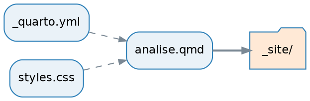

## Boas-vindas! {.smaller}

::::{.columns}
:::{.column width="55%"}
**O que você vai levar daqui**

- Escrever documentos que misturam texto, código e resultados
- Gerar HTML, PDF, Word e slides do mesmo arquivo
- Fazer relatórios que se atualizam sozinhos quando o dado muda
- Personalizar a aparência com CSS e `_brand.yml`

:::
:::{.column width="45%"}
**Antes de começarmos**

```bash
git clone https://github.com/\
juliaapolonio/intro-to-quarto.git
cd intro-to-quarto
conda env create -f environment.yml
conda activate quarto-env
positron .
```

E para conferir:

```bash
quarto check
```
:::
::::

::: {.callout-tip}
Todo o material, com as soluções, está em `minicurso-quarto.qmd`.
:::

## Agenda {.smaller}

| | Bloco | Tempo |
|:--|:--|--:|
| 1 | Introdução | 20 min |
| 2 | O Quarto | 25 min |
| 3 | Notação Markdown — **Ex. 1 e 2** | 70 min |
| — | ☕ Intervalo | 15 min |
| 4 | Header / YAML — **Ex. 3** | 35 min |
| 5 | Personalização — **Ex. 4** | 50 min |
| 6 | Code chunks — **Ex. 5** | 70 min |
| 7 | Encerramento | 15 min |


# 1. Introdução {background-color="#12355B"}

## O problema {.smaller}

::: {.incremental}
1. Rodar o pipeline
2. Gerar 12 figuras e 5 tabelas
3. Salvar tudo em `resultados/`
4. Abrir o Word e colar figura por figura
5. Escrever o texto ao redor
6. *"Pode trocar o corte de p < 0,05 para p < 0,01?"*
7. **Voltar ao passo 1**
:::

. . .

::: {.callout-important}
## A regra de ouro
Se você **copiou e colou** um resultado para dentro do texto, ele **vai** ficar
desatualizado. É só uma questão de tempo.
:::

## A solução: *literate programming* {.smaller}

Texto, código e resultado no **mesmo arquivo**.

::: {.fragment}
Você escreve **um** `.qmd`. O `knitr` executa o código, o Pandoc converte, e
saem HTML, PDF, Word ou slides — todos com os **mesmos** resultados.
:::

::: {.fragment}
A ideia é de Knuth (1984); a prática virou padrão em pesquisa reproduzível
(Peng 2011; Sandve et al. 2013).
:::

## Por que usar Quarto?

::: {.incremental}
- **Reprodutibilidade** — o número no texto foi *calculado*, não digitado
- **Rastreabilidade** — `.qmd` é texto puro → versiona no Git
- **Um fonte, vários destinos** — HTML, PDF, Word, slides, site, livro
- **Poliglota** — R, Python, Julia, Observable JS
- **Bonito por padrão** — sem precisar saber CSS
:::

::: {.fragment}
> Estes slides foram feitos em Quarto. O material do curso também.
:::

## Extensões

```bash
quarto add quarto-ext/fontawesome
quarto list extensions
quarto remove quarto-ext/fontawesome
```

| Extensão | Serve para |
|:--|:--|
| `quarto-ext/fontawesome` | Ícones |
| `quarto-journals/*` | Templates de periódicos |
| `quarto-ext/lightbox` | Ampliar figuras ao clicar |
| `shafayetShafee/downloadthis` | Botão de download |
| `quarto-ext/pointer` | Laser pointer nos slides |


## Documentação {.smaller}

- 📘 Guia: <https://quarto.org/docs/guide/>
- 🔎 Referência de YAML: <https://quarto.org/docs/reference/>
- 🖼️ Galeria: <https://quarto.org/docs/gallery/>
- ⭐ Awesome Quarto: <https://github.com/mcanouil/awesome-quarto>
- 💬 Dúvidas: <https://github.com/quarto-dev/quarto-cli/discussions>

. . .

::: {.callout-tip}
## Dica
Toda página da documentação mostra o `.qmd` que gerou o exemplo. Quando algo
parecer mágico, vá no código-fonte.
:::

# 2. O Quarto {background-color="#12355B"}

## As três partes de um `.qmd`

````markdown
---
title: "Meu relatório"      # 1. HEADER YAML
format: html
---

## Introdução                # 2. TEXTO EM MARKDOWN

Texto normal em **markdown**.
````

E a terceira parte, o **chunk**:

```{{r}}
#| label: exemplo
1 + 1
```

## Anatomia de um chunk

```{{r}}
#| label: minha-analise
#| echo: false
#| fig-cap: "Uma figura qualquer"

plot(1:10)
```

::: {.incremental}
- `` ```{r} `` → abre o bloco e define a linguagem
- `#|` (*hash-pipe*) → opções do chunk, em YAML
- `` ``` `` → fecha o bloco
:::

## Renderização

```bash
quarto render documento.qmd            # todos os formatos
quarto render documento.qmd --to pdf   # só um
quarto preview documento.qmd           # recarrega sozinho ✨
quarto render                          # projeto inteiro
```

. . .

No Positron / RStudio: botão **Render** ou `Ctrl/Cmd + Shift + K`.

. . .

::: {.callout-tip}
Deixe `quarto preview` rodando numa aba do terminal o curso inteiro.
:::

## Formatos de saída {.smaller}

| Formato | YAML | Nota |
|:--|:--|:--|
| Página web | `html` | Padrão, interativo |
| Artigo | `pdf` | Via LaTeX (TinyTeX) |
| Word | `docx` | Para colaborar fora do R |
| Slides | `revealjs`, `beamer`, `pptx` | `revealjs` é HTML |
| Site / livro | projeto `website` / `book` | Vários `.qmd` |
| Painel | `dashboard` | *Value boxes*, abas |
| README | `gfm` | Markdown do GitHub |

## R Markdown vs Quarto {.smaller}

| | R Markdown | Quarto |
|:--|:--|:--|
| Motor | Pacote `rmarkdown` (exige R) | Executável independente |
| Linguagens | R (+ `reticulate`) | R, Python, Julia, OJS |
| Opções | `{r fig.width=6}` | `#| fig-width: 6` |
| Cross-refs | Precisa de `bookdown` | Nativo |
| Callouts, tabsets | Pacotes / CSS | Nativos |
| Slides | `xaringan`, `ioslides` | `revealjs` |

## Duas armadilhas da migração

::: {.incremental}
1. **Ponto vira hífen**
   `fig.cap` → `fig-cap`, `out.width` → `out-width`

2. **Opções saem da chave e vão para o corpo**
:::

::: {.fragment}
Antes:

```{{r meu-chunk, echo=FALSE, fig.cap="Legenda"}}
plot(x, y)
```

Agora:

```{{r}}
#| label: meu-chunk
#| echo: false
#| fig-cap: "Legenda"
```
:::

::: {.fragment}
Boa notícia: `quarto render arquivo.Rmd` funciona. Migre aos poucos.
:::

# 3. Notação Markdown {background-color="#12355B"}

## Formatação de texto {.smaller}

::::{.columns}
:::{.column width="50%"}
```markdown
*itálico*
**negrito**
***os dois***
~~riscado~~
`código`
H~2~O
10^-9^
[versalete]{.smallcaps}
> citação
```
:::
:::{.column width="50%"}
*itálico*  
**negrito**  
***os dois***  
~~riscado~~  
`código`  
H~2~O  
10^-9^  
[versalete]{.smallcaps}

> citação
:::
::::

::: {.callout-warning appearance="simple"}
Parágrafo novo exige **linha em branco**.
:::

## Títulos

```markdown
# Nível 1
## Nível 2
### Nível 3

## Métodos {#sec-metodos}   ← id manual, para referenciar
```

. . .

::: {.callout-warning}
## Um `#` só
Se você usa `title:` no YAML, comece as seções em `##`.
:::

## Links e imagens

```markdown
[texto](https://quarto.org)
<https://quarto.org>
[para outra seção](#sec-metodos)


{width=60%}
{#fig-minha fig-align="left"}
```

. . .

A diferença entre link e imagem é o **`!`** na frente.

. . .

::: {.callout-tip appearance="simple"}
Use **caminhos relativos** — `imagens/fig.png`, nunca `/home/seu-usuario/...`
:::

## Listas {.smaller}

::::{.columns}
:::{.column width="50%"}
```markdown
- item
- outro
  - subitem

1. primeiro
2. segundo

- [ ] pendente
- [x] feito

FASTQ
: sequências e qualidades
```
:::
:::{.column width="50%"}
- item
- outro
  - subitem

<br>

1. primeiro
2. segundo

<br>

- [ ] pendente
- [x] feito

<br>

FASTQ
: sequências e qualidades
:::
::::

::: {.callout-warning appearance="simple"}
**Linha em branco antes da lista.** É o bug nº 1 de Markdown.
:::

## 🧪 Exercício 1 {background-color="#D95F02"}

**Crie `exercicio1.qmd` com:**

1. Header YAML: título, autoria, `format: html`
2. `## Sobre mim` — parágrafo com **negrito** e *itálico*
3. `## Meus hobbies` — lista **não ordenada** de 3 hobbies, sendo que um
   tem **dois subitens**
4. `## Minha rotina` — lista **ordenada** de 4 etapas do seu dia
5. Um link e uma imagem com `width=70%`

<div class="timer" data-minutes="15"></div>

::: {.callout-note appearance="simple"}
Solução na seção 4.5 do material
:::

## Footnotes

```markdown
Este método é amplamente usado.[^1]

[^1]: Ainda que existam críticas relevantes.

Ou em linha.^[Assim, sem declarar depois.]
```

. . .

O rótulo (`[^1]`, `[^metodo]`) é só interno — a numeração final é automática e
segue a ordem de aparição.

## Tabelas de pipe

```markdown
| Gene   | log2FC | p-ajustado |
|:-------|-------:|-----------:|
| BRCA1  |   2,31 |     0,0001 |
| TP53   |  -1,87 |     0,0034 |

: Genes diferencialmente expressos {#tbl-degs .striped}
```

. . .

| Gene   | log2FC | p-ajustado |
|:-------|-------:|-----------:|
| BRCA1  |   2,31 |     0,0001 |
| TP53   |  -1,87 |     0,0034 |

. . .

Alinhamento: `:---` esquerda · `---:` direita · `:---:` centro  
Classes: `.striped` `.hover` `.bordered` `.sm`

## Tabelas de grade

Quando a célula precisa de mais de uma linha:

```markdown
+-------------+------------------+
| Etapa       | Ferramentas      |
+=============+==================+
| QC          | - FastQC         |
|             | - MultiQC        |
+-------------+------------------+
| Alinhamento | - STAR           |
+-------------+------------------+
```

::: {.callout-tip appearance="simple"}
Acima de ~10 linhas: **gere a tabela por código** (`knitr::kable`, `gt`).  
Conversor útil: <https://www.tablesgenerator.com/markdown_tables>
:::

## Equações

Em linha: `$E = mc^2$` → $E = mc^2$

. . .

Em bloco, com id para referenciar:

```markdown
$$
\log_2 \text{FC} = \log_2\!\left(\frac{\mu_{trat}}{\mu_{ctrl}}\right)
$$ {#eq-log2fc}
```

$$
\log_2 \text{FC} = \log_2\!\left(\frac{\mu_{trat}}{\mu_{ctrl}}\right)
$$

. . .

E no texto: `A @eq-log2fc mostra...` → "A Equação 1 mostra..."

## Diagramas — Mermaid {.smaller}

:::::{.columns}
::::{.column width="50%"}
**Você escreve**

```{{mermaid}}
flowchart TD
    A[FASTQ] --> B[QC]
    B --> C{Qualidade OK?}
    C -->|Sim| D[Alinhamento]
    C -->|Não| E[Trimagem]
    E --> B
```
::::
::::{.column width="50%"}
**Sai isto**

::: {.diagrama-cabe}
```{mermaid}
%%| echo: false
flowchart TD
    A[FASTQ] --> B[QC]
    B --> C{Qualidade OK?}
    C -->|Sim| D[Alinhamento]
    C -->|Não| E[Trimagem]
    E --> B
```
:::
::::
:::::


## Diagramas — Graphviz {.smaller}

::::{.columns}
:::{.column width="42%"}

:::
:::{.column width="58%"}
```{dot}
//| echo: false
//| fig-width: 5.6
//| fig-height: 3.6
digraph G {
  rankdir=LR;
  bgcolor="transparent";
  node [shape=box, style="rounded,filled", fillcolor="#EAF2F8",
        color="#2C7FB8", fontname="Helvetica", fontsize=11];
  edge [color="#7A8894", arrowsize=0.7, style=dashed];
  saida [label="_site/", shape=folder, fillcolor="#FFE9D6"];
  "_quarto.yml" -> "analise.qmd";
  "styles.css"  -> "analise.qmd";
  "analise.qmd" -> saida [style=solid, penwidth=2];
}
```

**O que dá para mexer**

- `rankdir` — direção do fluxo
- `shape` — `box`, `ellipse`, `folder`, `cylinder`, `diamond`
- `fillcolor` / `color` — preenchimento e borda
- `style` — `dashed`, `bold`, `rounded`
- `penwidth` — espessura da seta
:::
::::

## Citações {.smaller}

No YAML:

```yaml
bibliography: referencias.bib
csl: nature.csl        # opcional
```

::::{.columns}
:::{.column width="45%"}
| Sintaxe | Saída |
|:--|:--|
| `[@sandve2013]` | (Sandve et al., 2013) |
| `@sandve2013` | Sandve et al. (2013) |
| `[@a; @b]` | (A, 2011; B, 2013) |
| `[-@peng2011]` | (2011) |
:::
:::{.column width="55%"}
```bibtex
@article{sandve2013,
  author  = {Sandve, G. K. and others},
  title   = {Ten Simple Rules for
             Reproducible Research},
  journal = {PLoS Comput Biol},
  year    = {2013}
}
```
:::
::::

::: {.callout-tip}
## De onde vem o `.bib`?

- **Zotero** com o plugin *Better BibTeX* exporta e mantém o arquivo
  atualizado sozinho.
- No R, `citation("DESeq2")` devolve a entrada BibTeX do pacote — sempre cite
  as ferramentas que você usou.
- Para o estilo do periódico, baixe o `.csl` em
  [citation-style-language/styles](https://github.com/citation-style-language/styles).
:::

## 🧪 Exercício 2 {background-color="#D95F02"}

**Adicione ao seu documento:**

1. Uma **tabela** com 4 genes e 3 colunas, com id `#tbl-genes`, referenciada no texto
2. Uma **equação numerada** (`#eq-media`), referenciada no texto
3. Um **diagrama Mermaid** do seu fluxo de trabalho
4. Uma **footnote**
5. **Duas citações** + um `referencias.bib` que você mesmo cria + seção de referências

<div class="timer" data-minutes="20"></div>

::: {.callout-note appearance="simple"}
Solução na seção 4.11 do material
:::

# ☕ Intervalo — 15 min {background-color="#7FBC41"}

# 4. Header {background-color="#12355B"}

## O painel de controle {.smaller}

::::{.columns}
:::{.column width="48%"}
**Mínimo**

```yaml
---
title: "Análise"
format: html
---
```

**Confortável**

```yaml
---
title: "Análise"
subtitle: "Projeto Caatinga-Seq"
author: "Fulana de Tal"
date: today
lang: pt-BR
format: html
---
```
:::
:::{.column width="52%"}
**Completo**

```yaml
---
title: "Análise"
author:
  - name: "Fulana de Tal"
    email: "fulana@ufrn.br"
    affiliation: "UFRN"
    orcid: "0000-0000-0000-0000"
date: today
lang: pt-BR
abstract: |
  Relatório da análise de 12 amostras.
format:
  html:
    toc: true
    number-sections: true
    code-fold: true
bibliography: referencias.bib
---
```
:::
::::

## Opções de HTML que valem a pena {.smaller}

| Opção | Efeito |
|:--|:--|
| `toc: true` / `toc-location: left` | Sumário |
| `number-sections: true` | Numera seções (**necessário para `@sec-`**) |
| `code-fold: true` / `show` | Código recolhido |
| `code-tools: true` | Menu para baixar o fonte |
| `df-print: paged` | Data frames paginados |
| `theme: cosmo` | Tema Bootswatch |
| `anchor-sections: true` | Link permanente nos títulos |

## `embed-resources` {.smaller}

```yaml
format:
  html:
    embed-resources: true
```

. . .

::: {.callout-important}
## A opção mais útil deste curso
Sem ela: `documento.html` + pasta `documento_files/`.  
Se você mandar só o HTML por e-mail, **ele chega quebrado**.

Com ela: **um único arquivo**, com tudo embutido, que abre offline.
:::

. . .

Custo: arquivo maior e render um pouco mais lento.  
`self-contained: true` era o nome antigo — está **depreciado**.

## Cache {.smaller}

```yaml
execute:
  cache: true          # documento inteiro
```

```{{r}}
#| label: modelo-pesado
#| cache: true         # só este chunk
resultado <- DESeq(dds)
```

. . .

::: {.callout-warning}
## A pegadinha
O `knitr` detecta mudanças no **código**, não nos **dados**.  
Editou o CSV sem tocar no código? O cache serve o resultado **velho**.
:::

. . .

```{{r}}
#| cache: true
#| dependson: ["carrega-dados"]
```

::: {.callout-warning appearance="simple"}
O chunk citado em `dependson` também precisa ter `cache: true` — senão o
`knitr` para com `must not depend on the uncached chunk`.
:::

Limpar: `quarto render --cache-refresh` ou apagar `*_cache/`.

## `freeze`: cache para projetos

```yaml
execute:
  freeze: auto      # só re-executa se o .qmd mudar
```

. . .

Os resultados vão para `_freeze/` e **podem ser commitados**.

. . .

::: {.callout-tip}
Isso permite publicar o site num servidor que **não tem R instalado** — e sem
subir os dados brutos.
:::

## Documento vs chunk {.smaller}

| | Documento | Chunk |
|:--|:--|:--|
| Onde | Topo, entre `---` | Dentro, com `#|` |
| Alcance | Tudo | Só ali |
| Sintaxe | YAML | YAML com `#|` |

. . .

**O mais específico vence:**

```yaml
---
execute:
  echo: false      # nenhum código aparece...
---
```

```{{r}}
#| echo: true      # ...exceto neste
head(mtcars)
```

## Opções de chunk essenciais {.smaller}

| Opção | Efeito |
|:--|:--|
| `eval` | Executa? |
| `echo` | Mostra o código? |
| `output` | Mostra o resultado? |
| `warning` / `message` | Mostra avisos / mensagens? |
| `error: true` | Continua mesmo com erro |
| `include: false` | Executa e não mostra **nada** |
| `label` | Identificador (para cross-refs) |
| `fig-cap`, `fig-width`, `out-width`, `fig-alt` | Figuras |

## O chunk `setup` {.smaller}

Por convenção, o **primeiro** chunk do documento. Concentra tudo que os
demais vão precisar.

```{{r}}
#| label: setup
#| include: false

library(tidyverse)
knitr::opts_chunk$set(fig.align = "center", dpi = 300)
set.seed(42)
```

. . .

| Linha | O que faz |
|:--|:--|
| `#| label: setup` | Dá nome ao chunk — é o nome que aparece se der erro |
| `#| include: false` | Executa tudo, mas não mostra código nem saída |
| `library(tidyverse)` | Carrega os pacotes uma vez só, para o documento inteiro |
| `opts_chunk$set(...)` | Define o padrão de **todos** os chunks seguintes |
| `set.seed(42)` | Fixa a aleatoriedade: simulação, *bootstrap*, UMAP… |

## 🧪 Exercício 3 {background-color="#D95F02"}

**Transforme o header do seu documento:**

1. Autoria com `name` e `affiliation`; `date: today`; `lang: pt-BR`
2. Sumário à esquerda (profundidade 2) e seções numeradas
3. `code-fold` e `code-tools`
4. `embed-resources: true`
5. Sem avisos nem mensagens
6. Um chunk `setup` com `include: false`
7. Um chunk que executa mas **não mostra** o código
8. Um chunk com `cache: true`

**Desafio:** um chunk que **mostra** sem executar (comando de cluster)

<div class="timer" data-minutes="15"></div>

::: {.callout-note appearance="simple"}
Solução na seção 5.5 do material
:::

# 5. Personalização {background-color="#12355B"}

## Callouts

```markdown
::: {.callout-tip}
## Título personalizado
Conteúdo.
:::
```

::::{.columns}
:::{.column width="50%"}
::: {.callout-note appearance="simple"}
`note` — observação
:::
::: {.callout-tip appearance="simple"}
`tip` — dica
:::
::: {.callout-warning appearance="simple"}
`warning` — aviso
:::
:::
:::{.column width="50%"}
::: {.callout-important appearance="simple"}
`important` — crítico
:::
::: {.callout-caution appearance="simple"}
`caution` — cuidado
:::

Atributos: `collapse="true"`, `appearance="simple"`, `icon=false`
:::
::::

## Colunas {.smaller}

::::{.columns}
:::{.column width="54%"}
**Você escreve**

```markdown
:::: {.columns}
::: {.column width="60%"}
O texto explicativo fica aqui,
e a figura fica ao lado.
:::
::: {.column width="40%"}

:::
::::
```
:::
:::{.column width="46%"}
**Sai isto**

<div style="display:flex; gap:1em; align-items:center; border:1px solid #DDE3E8; border-radius:8px; padding:0.9em;">
  <div style="flex:0 0 60%; font-size:0.9em;">O texto explicativo fica aqui, e a figura fica ao lado.</div>
  <div style="flex:0 0 32%;"></div>
</div>
:::
::::

::: {.callout-warning appearance="simple"}
A div **externa** precisa de **mais** `:` que as internas — `::::` fora,
`:::` dentro. É assim que o Pandoc sabe qual fecha qual.
:::::::

## Tabsets

```markdown
::: {.panel-tabset}
## R
Código em R.
## Python
Código em Python.
:::
```

::: {.panel-tabset}
### R

```r
media <- mean(c(1, 2, 3, 4, 5))
```

### Python

```python
import statistics
media = statistics.mean([1, 2, 3, 4, 5])
```

### Bash

```bash
awk '{s+=$1} END {print s/NR}' numeros.txt
```
:::

## CSS {.smaller}

```yaml
format:
  html:
    theme: cosmo
    css: styles.css      # <- seu arquivo
```

::::{.columns}
:::{.column width="50%"}
**`styles.css`**

```css
.destaque {
  background: #FFF3CD;
  padding: 0.1em 0.35em;
  border-radius: 4px;
  font-weight: 600;
}

h2 {
  color: #2C7FB8;
  border-bottom: 2px solid #2C7FB8;
}
```

**No `.qmd`**

```markdown
## Resultados

O ponto-chave é o
[controle de qualidade]{.destaque}.
```
:::
:::{.column width="50%"}
**Como fica**

<div style="background:#fff; border:1px solid #DDE3E8; border-radius:8px; padding:1em 1.1em; color:#1A1A1A; font-size:0.95em;">
<div style="color:#2C7FB8; border-bottom:2px solid #2C7FB8; font-size:1.35em; font-weight:650; padding-bottom:0.15em; margin-bottom:0.5em;">Resultados</div>
<p style="margin:0;">O ponto-chave é o <span style="background:#FFF3CD; padding:0.1em 0.35em; border-radius:4px; font-weight:600;">controle de qualidade</span>.</p>
</div>

::: {.callout-tip appearance="simple"}
Botão direito → **Inspecionar** mostra qual classe controla cada elemento.
:::
:::
::::

## SCSS: mexer no tema por dentro {.smaller}

O CSS **pinta por cima**; o SCSS muda as variáveis **antes** de o tema ser
compilado.

::::{.columns}
:::{.column width="52%"}
```yaml
format:
  html:
    theme: [cosmo, custom.scss]
```

```scss
/*-- scss:defaults --*/
// trocado ANTES de compilar o tema
$primary:   #D95F02;
$body-bg:   #FDF8F3;
$h2-font-size: 1.6rem;

/*-- scss:rules --*/
// CSS comum, aplicado DEPOIS
.callout-note {
  border-left-color: $primary;
}
```
:::
:::{.column width="48%"}
**Como fica**

<div style="background:#FDF8F3; border:1px solid #E6D9CC; border-radius:8px; padding:1em 1.1em; color:#1A1A1A; font-size:0.95em;">
<div style="color:#D95F02; font-size:1.3em; font-weight:650; margin-bottom:0.5em;">Métodos</div>
<div style="border-left:5px solid #D95F02; background:#FFF; padding:0.5em 0.8em; border-radius:0 4px 4px 0;">
<strong style="color:#D95F02;">Nota</strong><br/>
O botão e o link herdam <code>$primary</code> sozinhos.
</div>
<p style="margin:0.7em 0 0;"><a href="#" style="color:#D95F02;">Este link</a> mudou de cor sem eu tocar nele.</p>
</div>

::: {.callout-tip appearance="simple"}
Uma variável em `scss:defaults` repercute em **tudo** — links, botões,
callouts, tabelas.
:::
:::
::::

## O mesmo documento, dois temas {.smaller}

```yaml
format:
  html:
    theme:
      light: flatly     # botão de alternância aparece sozinho
      dark: darkly
```

::::{.columns}
:::{.column width="50%"}
<div style="background:#FFFFFF; border:1px solid #D6DCE2; border-radius:8px; padding:0.9em 1em; font-size:0.72em; color:#212529;">
<div style="font-size:0.8em; color:#95A5A6; border-bottom:1px solid #ECF0F1; padding-bottom:0.35em; margin-bottom:0.6em;">☀️ flatly</div>
<div style="color:#2C3E50; font-size:1.5em; font-weight:650;">Expressão diferencial</div>
<p style="margin:0.4em 0 0.7em; color:#5D6D7E;">Foram testados 1 843 genes; 118 passaram o filtro.</p>
<div style="border-left:5px solid #18BC9C; background:#F4FBF9; padding:0.45em 0.7em;">
<strong style="color:#18BC9C;">Nota</strong> — dados simulados.</div>
<pre style="background:#ECF0F1; padding:0.5em 0.7em; border-radius:4px; margin:0.7em 0 0;"><code style="color:#2C3E50;">res &lt;- results(dds)</code></pre>
</div>
:::
:::{.column width="50%"}
<div style="background:#222222; border:1px solid #3A3A3A; border-radius:8px; padding:0.9em 1em; font-size:0.72em; color:#E8E8E8;">
<div style="font-size:0.8em; color:#888; border-bottom:1px solid #3A3A3A; padding-bottom:0.35em; margin-bottom:0.6em;">🌙 darkly</div>
<div style="color:#FFFFFF; font-size:1.5em; font-weight:650;">Expressão diferencial</div>
<p style="margin:0.4em 0 0.7em; color:#B4BCC2;">Foram testados 1 843 genes; 118 passaram o filtro.</p>
<div style="border-left:5px solid #00BC8C; background:#2B2B2B; padding:0.45em 0.7em;">
<strong style="color:#00BC8C;">Nota</strong> — dados simulados.</div>
<pre style="background:#303030; padding:0.5em 0.7em; border-radius:4px; margin:0.7em 0 0;"><code style="color:#E8E8E8;">res &lt;- results(dds)</code></pre>
</div>
:::
::::

::: {.callout-note appearance="simple"}
Mesmo `.qmd`, mesmo conteúdo — só o `theme` mudou. Nada no texto foi tocado.
:::

## `_brand.yml` {.smaller}

Uma identidade visual, **todos** os formatos.

```yaml
# _brand.yml (na raiz do projeto)
color:
  palette:
    azul-profundo: "#12355B"
    laranja: "#D95F02"
  primary: azul-profundo
  secondary: laranja

typography:
  fonts:
    - family: Roboto
      source: google
  base: Roboto
  headings: {family: Roboto, weight: 600}

logo:
  medium: logos/logo.png
```

Nada precisa ser declarado no `.qmd`. Para desligar: `brand: false`.

## `_quarto.yml`: o projeto inteiro {.smaller}

```yaml
project:
  type: website
  output-dir: _site

website:
  title: "Projeto Caatinga-Seq"
  navbar:
    left:
      - href: index.qmd
        text: Início
      - href: resultados.qmd
        text: Resultados

format:
  html:
    theme: cosmo
    css: styles.css
    toc: true

execute:
  freeze: auto
```

Vale para todos os `.qmd` — e cada um pode sobrescrever.

## Personalização no PDF {.smaller}

```yaml
format:
  pdf:
    documentclass: article
    papersize: a4
    geometry: [top=25mm, bottom=25mm, left=25mm, right=25mm]
    fontsize: 11pt
    linestretch: 1.5
    colorlinks: true
    toc: true
    number-sections: true
    fig-pos: "H"        # fixa a figura onde ela foi escrita
```

::: {.callout-warning}
## Erros clássicos
- Pacote LaTeX faltando → `quarto install tinytex`
- Figura "fugindo" de página → `fig-pos: "H"`
- **CSS não funciona no PDF.** No PDF, o equivalente é LaTeX.
:::

## Conteúdo condicional

```markdown
::: {.content-visible when-format="html"}
Tabela interativa aqui.
:::

::: {.content-visible when-format="pdf"}
Tabela estática aqui.
:::

::: {.content-hidden when-format="pdf"}
Tudo menos PDF.
:::
```

. . .

```yaml
format:
  html: {toc: true}
  pdf: {documentclass: article}
```

```bash
quarto render doc.qmd          # os dois
quarto render doc.qmd --to pdf # só um
```

## 🧪 Exercício 4 {background-color="#D95F02"}

1. Um callout de cada tipo — um com título próprio, outro recolhível
2. Um bloco de **duas colunas**
3. Um **tabset** com duas abas
4. Um `styles.css` com a classe `.destaque` e `h2` colorido — e aplique
5. Tema claro/escuro alternável

**Desafios**

6. Adicione `format: pdf` e use **conteúdo condicional** para uma frase
   aparecer só no HTML
7. Um `_brand.yml` com duas cores e uma fonte do Google

<div class="timer" data-minutes="20"></div>

::: {.callout-note appearance="simple"}
Solução na seção 6.5 do material
:::

# 🍽️ Hora do almoço {background-color="#7FBC41"}

::: {style="text-align: center; font-size: 1.15em; margin-top: 1em;"}
Voltamos para o último bloco: **code chunks**.

Deixe o `quarto preview` rodando — a gente retoma direto do seu documento.
:::

# 6. Code chunks {background-color="#12355B"}

## O básico

```{r}
#| label: media-slide
x <- c(12, 15, 9, 22, 18)
mean(x)
```

. . .

O código aparece, o resultado aparece embaixo, e o resultado **é de verdade** —
foi calculado agora, na renderização.

## Código inline: o recurso mais subestimado

```{r}
#| include: false
set.seed(2026)
expressao <- rnorm(120, mean = 8.4, sd = 1.9)
```

Você escreve:

> Foram analisadas `r knitr::inline_expr("length(expressao)")` medidas, com
> média de `r knitr::inline_expr("round(mean(expressao), 2)")`.

. . .

E sai:

> Foram analisadas `r length(expressao)` medidas, com média de
> `r round(mean(expressao), 2)` e desvio de `r round(sd(expressao), 2)`.

. . .

::: {.callout-important}
Se o dado mudar, **a frase muda sozinha**.
:::

## Plots

```{r}
#| label: fig-slide-plot
#| fig-cap: "Peso versus consumo no mtcars."
#| fig-width: 8
#| fig-height: 3.6

plot(mtcars$wt, mtcars$mpg, pch = 19, col = "#2C7FB8",
     xlab = "Peso", ylab = "Milhas por galão")
abline(lm(mpg ~ wt, data = mtcars), col = "#D95F02", lwd = 2)
```

## Opções de figura {.smaller}

| Opção | Efeito |
|:--|:--|
| `fig-cap` | Legenda |
| `fig-width` / `fig-height` | Tamanho **em polegadas** com que o R desenha |
| `out-width` | Tamanho na página (`"70%"`) |
| `fig-align` | `left`, `center`, `right` |
| `fig-alt` | Texto alternativo — **acessibilidade** |
| `fig-dpi` | 300 para publicação |
| `column: margin` | Figura na margem |

## Subfiguras num só chunk

```{r}
#| label: fig-slide-painel
#| fig-cap: "Distribuições"
#| fig-subcap: ["Consumo", "Potência"]
#| layout-ncol: 2
#| fig-width: 4.5
#| fig-height: 3

hist(mtcars$mpg, col = "#2C7FB8", border = "white", main = "", xlab = "mpg")
hist(mtcars$hp, col = "#D95F02", border = "white", main = "", xlab = "hp")
```

Ids automáticos: `@fig-slide-painel-1`, `@fig-slide-painel-2`

## Tabelas por código {.smaller}

::: {.panel-tabset}

### `kable`

O básico, sempre funciona, em todos os formatos.

```{r}
#| label: tbl-kable
#| tbl-cap: "Primeiras linhas do mtcars."
knitr::kable(head(mtcars[, c("mpg", "cyl", "hp")], 4),
             col.names = c("Consumo", "Cilindros", "Potência"))
```

### `gt`

Tabelas de publicação: títulos, notas de rodapé, formatação por coluna.

```{r}
library(gt)

head(mtcars[, c("mpg", "cyl", "hp")], 3) |>
  gt(rownames_to_stub = TRUE) |>
  tab_header(title = "Consumo por modelo") |>
  fmt_number(columns = mpg, decimals = 1) |>
  tab_source_note("Fonte: Motor Trend, 1974.")
```

### `kableExtra`

Agrupa colunas e linhas, fixa cabeçalho, colore células.

```{r}
library(kableExtra)

kbl(head(mtcars[, 1:3], 3)) |>
  kable_styling(bootstrap_options = c("striped", "hover"),
                full_width = FALSE) |>
  add_header_above(c(" " = 1, "Motor" = 3)) |>
  column_spec(2, color = "white", background = "#2C7FB8")
```

### `DT`

Interativa: busca, ordenação e paginação. **Só HTML.**

```{r}
DT::datatable(mtcars[, 1:4],
              options = list(pageLength = 4, dom = "tp"))
```

:::

## Cross-references {.smaller}

**Duas regras:** rótulo com o prefixo certo + `@rotulo` no texto.

| Elemento | Prefixo | Rotular com | Citar |
|:--|:--|:--|:--|
| Figura (chunk) | `fig-` | `label` + `fig-cap` | `@fig-x` |
| Figura (markdown) | `fig-` | `{#fig-x}` | `@fig-x` |
| Tabela (chunk) | `tbl-` | `label` + `tbl-cap` | `@tbl-x` |
| Tabela (markdown) | `tbl-` | `: Cap {#tbl-x}` | `@tbl-x` |
| Equação | `eq-` | `$$..$$ {#eq-x}` | `@eq-x` |
| Seção | `sec-` | `## Tít {#sec-x}` | `@sec-x` |

## Cross-reference na prática {.smaller}

::::{.columns}
:::{.column width="47%"}
**Você escreve**

````markdown
```{{r}}
#| label: fig-consumo
#| fig-cap: "Peso versus consumo."
plot(mtcars$wt, mtcars$mpg)
```

A relação está na @fig-consumo.
````
:::
:::{.column width="53%"}
**Sai isto**

```{r}
#| label: fig-consumo
#| echo: false
#| fig-cap: "Peso versus consumo."
#| fig-width: 4.6
#| fig-height: 2.9
plot(mtcars$wt, mtcars$mpg, pch = 19, col = "#2C7FB8",
     xlab = "Peso", ylab = "Consumo")
```

A relação está na @fig-consumo.
:::
::::

::: {.callout-important appearance="simple"}
A numeração e o link são automáticos. Insira uma figura antes desta e ela
vira "Figura 2" sozinha — em todo o documento.
:::

## Três armadilhas de cross-reference

::: {.incremental}
1. **Sem legenda, sem referência.** `label: fig-x` sem `fig-cap` não vira
   figura referenciável.
2. **`@sec-` exige `number-sections: true`.**
3. **O prefixo é literal.** `label: figura-1` ❌ · `label: fig-1` ✅
:::

. . .

Variações: `@fig-x` → Figura 1 · `[@fig-x]` → (Figura 1) · `[-@fig-x]` → 1

## Outras linguagens

```{{python}}
import pandas as pd
df = pd.read_csv("counts.csv")
print(df.describe())
```

```{{bash}}
#| eval: false
fastqc -t 8 -o qc/ dados/*.fastq.gz
multiqc qc/ -o qc/
```

. . .

::: {.callout-note appearance="simple"}
`engine: knitr` mistura R e Python (via `reticulate`).  
`engine: jupyter` roda um kernel só. Documento só-Python usa `jupyter` sozinho.
:::

## 🧬 Exercício 5 — o integrador {background-color="#D95F02" .smaller}

Construa `exercicio5.qmd`: um relatório de expressão diferencial completo.

::::{.columns}
:::{.column width="50%"}
**Header e dados**

1. Autoria, `date: today`, `lang: pt-BR`
2. TOC à esquerda, numeração, `code-fold: show`, `code-tools`, `embed-resources`
3. Sem warnings/messages; `bibliography`
4. Chunk `setup` com `set.seed(2026)`
5. Simule **2000 genes × 12 amostras**, com **150 genes DE**
6. Chunk **com cache**: log2FC, teste *t*, correção BH
:::
:::{.column width="50%"}
**Resultados e acabamento**

7. Tabela dos 10 mais significativos → `@tbl-top-genes`
8. **Volcano plot** → `@fig-volcano` (com `fig-alt`!)
9. Painel com **2 subfiguras** → `@fig-diagnostico`
10. **3 números** vindos de código inline
11. Equação numerada do log2FC
12. Um callout de limitação
13. Citação + referências
14. `sessionInfo()`
:::
::::

## 🧬 Exercício 5 — colas de código {.smaller}

::: {.panel-tabset}

### 5. Simular

```{{r}}
set.seed(2026)
n_genes <- 2000; n_por_grupo <- 6; n_de <- 150

mu <- rgamma(n_genes, shape = 2, scale = 60)
contagens <- sapply(1:(2*n_por_grupo),
                    \(j) rnbinom(n_genes, mu = mu, size = 8))
rownames(contagens) <- sprintf("GENE%04d", 1:n_genes)
grupo <- factor(rep(c("controle","tratado"), each = n_por_grupo))

# aplica o efeito só nas amostras tratadas
genes_de <- sample(n_genes, n_de)
efeito   <- sample(c(2.5, 0.4), n_de, replace = TRUE)
contagens[genes_de, grupo == "tratado"] <-
  round(contagens[genes_de, grupo == "tratado"] * efeito)
```

### 6. Testar

```{{r}}
cpm     <- t(t(contagens) / colSums(contagens)) * 1e6
log_cpm <- log2(cpm + 1)[rowMeans(cpm) > 1, ]

log2fc <- rowMeans(log_cpm[, grupo == "tratado"]) -
          rowMeans(log_cpm[, grupo == "controle"])

pvalor <- apply(log_cpm, 1, \(y)
  t.test(y[grupo == "tratado"], y[grupo == "controle"])$p.value)

res <- data.frame(gene = rownames(log_cpm), log2FC = log2fc,
                  padj = p.adjust(pvalor, "BH"))
res <- res[order(res$padj), ]
```

### 7-8. Tabela e volcano

```{{r}}
#| label: tbl-top-genes
#| tbl-cap: "Dez genes mais significativos."
knitr::kable(head(res, 10), digits = 3)
```

```{{r}}
#| label: fig-volcano
#| fig-cap: "Volcano plot."
#| fig-alt: "Dispersão de log2FC contra -log10(p), em forma de V."
cor <- ifelse(res$padj < 0.05 & abs(res$log2FC) > 1, "#D95F02", "grey70")
plot(res$log2FC, -log10(res$padj), pch = 19, cex = .6, col = cor,
     xlab = "log2 FC", ylab = "-log10(p ajustado)")
abline(h = -log10(0.05), v = c(-1, 1), lty = 2)
```

### 9-10. Painel e inline

```{{r}}
#| label: fig-diagnostico
#| fig-cap: "Diagnóstico."
#| fig-subcap: ["p-valores", "log2FC"]
#| layout-ncol: 2
hist(res$padj);  hist(res$log2FC)
```

```{{r}}
#| include: false
sig <- subset(res, padj < 0.05 & abs(log2FC) > 1)
n_sig <- nrow(sig); n_up <- sum(sig$log2FC > 0)
```

Depois, no **texto**: cerca de `r knitr::inline_expr("n_sig")` genes, dos
quais `r knitr::inline_expr("n_up")` super-expressos.

### 11-14. Acabamento

```markdown
$$
\log_2 FC_g = \overline{\log_2 CPM}_{trat}
             - \overline{\log_2 CPM}_{ctrl}
$$ {#eq-log2fc}

Conforme a @eq-log2fc...

::: {.callout-warning}
## Limitações
Dados simulados; o teste *t* ignora a relação
média-variância. Use DESeq2 no mundo real.
:::

Seguimos @sandve2013.

## Referências

::: {#refs}
:::
```

```{{r}}
sessionInfo()
```

:::

## 🎯 Critério de sucesso {background-color="#D95F02"}

Troque `n_de <- 150` por `n_de <- 300` e renderize de novo.

. . .

**Tudo** deve mudar sozinho: a tabela, as duas figuras e os números do
parágrafo — sem você tocar em uma vírgula do texto.

. . .

::: {.callout-important}
Se usou `cache: true`, vai precisar de `dependson: ["simulacao"]`.  
Senão o cache serve o resultado antigo — exatamente a pegadinha do bloco 4.
:::

<div class="timer" data-minutes="40"></div>

::: {.callout-note appearance="simple"}
Solução completa e comentada na seção 7.7 do material
:::

# 7. Encerramento {background-color="#12355B"}

## O que vimos

```{mermaid}
%%| echo: false
%%| fig-width: 11
flowchart LR
    Q(("Quarto")) --> M["Markdown"]
    Q --> H["Header"]
    Q --> P["Personalização"]
    Q --> C["Code chunks"]
    M --> M1["Texto · tabelas · equações<br/>diagramas · citações"]
    H --> H1["YAML · opções de chunk<br/>embed-resources · cache"]
    P --> P1["Callouts · colunas · tabsets<br/>CSS · SCSS · brand.yml"]
    C --> C1["Plots · tabelas · inline<br/>cross-references"]
```

## Cinco hábitos para levar daqui {.smaller}

::: {.incremental}
1. **Nunca digite um número que o computador pode calcular.** Use código inline.
2. **Comece pelo `embed-resources: true`.** Relatório que abre quebrado não é lido.
3. **Rotule figuras e tabelas desde o início.** Renomear depois dói.
4. **Deixe o `quarto preview` rodando.** Ver o erro na hora que ele aparece
   custa segundos; achá-lo depois de 40 edições custa a tarde.
5. **Demorou mais de 30 s? Use cache** — e lembre do `dependson`.
:::

## Para onde ir agora {.smaller}

| Quero… | Procure por |
|:--|:--|
| Site do laboratório | Quarto Websites + GitHub Pages |
| Escrever a dissertação | Quarto Books, `quarto-journals` |
| Painel de resultados | `format: dashboard` |
| Um relatório por amostra | Parâmetros + `quarto_render()` |
| Ambiente reproduzível | `renv`, `conda`, Docker |
| Publicar rápido | `quarto publish quarto-pub` |

. . .

**No material completo:** anexos sobre parâmetros, publicação, solução de
problemas, `environment.yml` e uma cola rápida.

## Obrigada! {.center background-color="#12355B"}

::: {style="text-align: center; font-size: 1.3em; margin-top: 1em;"}
📁 `github.com/juliaapolonio/intro-to-quarto`

📘 `minicurso-quarto.qmd` — conteúdo e soluções

🌐 <https://quarto.org/docs/guide/>
:::

::: {style="text-align: center; margin-top: 1.5em;"}
**Dúvidas?**
:::
